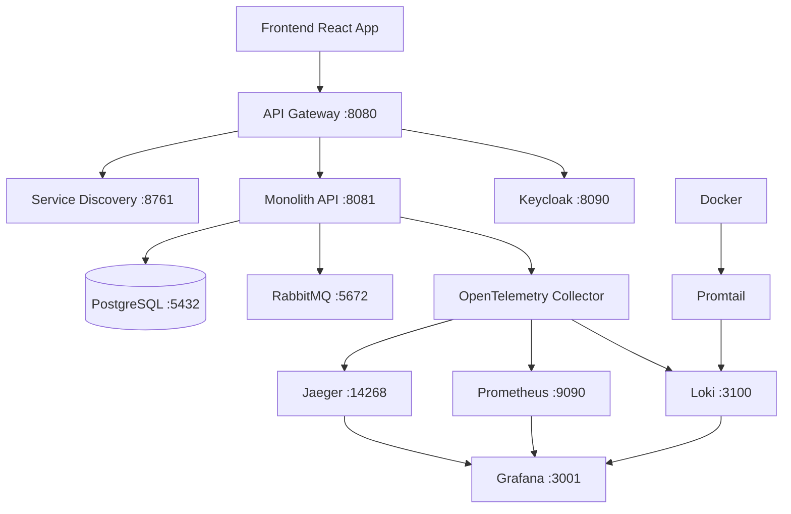

# MTN Admission System - Phase 1 Implementation
## Containerized Microservices Architecture with Full Observability

[](./Dockerfile)
[](#observability-stack)
[](#keycloak-oidc-authentication)
[](#documentation)

---

## 📋 Project Overview

The **MTN Admission System** is a comprehensive school admission management platform for Colegio Monte Tabor y Nazaret. This Phase 1 implementation provides a containerized monolith with full observability stack, preparing for gradual migration to microservices architecture.

### 🎯 Phase 1 Goals
- **Containerization**: Docker-based deployment for monolith and frontend
- **API Gateway**: Spring Cloud Gateway with Service Discovery  
- **Authentication**: Keycloak OIDC with JWT validation
- **Observability**: Complete telemetry with OpenTelemetry, Prometheus, Grafana, Loki, and Jaeger
- **Service Discovery**: Eureka Server for service registration
- **Event Infrastructure**: RabbitMQ for future event-driven architecture

---

## 🚀 Quick Start

### Prerequisites
- Docker and Docker Compose
- Java 17+ (for local development)
- Node.js 18+ (for frontend development)
- PostgreSQL 15+ (or use containerized version)

### 1. Clone and Setup
```bash
# Clone the repository
git clone <repository-url>
cd MTN-admission-system

# Copy environment template
cp .env.example .env

# Edit environment variables
nano .env
```

### 2. Start Full Infrastructure
```bash
# Start all services
docker-compose up -d

# Check services status
make status

# View logs
docker-compose logs -f
```

### 3. Access Services
| Service | URL | Credentials |
|---------|-----|-------------|
| **Frontend** | http://localhost:3000 | - |
| **API Gateway** | http://localhost:8080 | - |
| **Monolith API** | http://localhost:8081 | - |
| **Eureka Dashboard** | http://localhost:8761 | - |
| **Keycloak Admin** | http://localhost:8090 | admin/admin123 |
| **Grafana** | http://localhost:3001 | admin/admin123 |
| **Prometheus** | http://localhost:9090 | - |
| **Jaeger UI** | http://localhost:16686 | - |
| **RabbitMQ** | http://localhost:15672 | admin/admin123 |

---

## 🏗️ Architecture Overview

### System Architecture Diagram


### 📦 Service Inventory

| Component | Port | Purpose | Technology Stack |
|-----------|------|---------|-----------------|
| **Frontend** | 3000 | React SPA with auth integration | React 19, TypeScript, Tailwind CSS |
| **API Gateway** | 8080 | Request routing, JWT validation | Spring Cloud Gateway, Eureka Client |
| **Monolith API** | 8081 | Core business logic | Spring Boot 3.5, PostgreSQL, JWT |
| **Eureka Server** | 8761 | Service discovery registry | Spring Cloud Netflix Eureka |
| **Keycloak** | 8090 | OIDC authentication provider | Keycloak 23.0.1 |
| **PostgreSQL** | 5432 | Primary database | PostgreSQL 15 |
| **RabbitMQ** | 5672, 15672 | Message broker for events | RabbitMQ 3.12 Management UI |
| **Prometheus** | 9090 | Metrics collection and storage | Prometheus 2.45 |
| **Grafana** | 3001 | Observability dashboards | Grafana 10.0 with multiple datasources |
| **Jaeger** | 16686, 14268 | Distributed tracing | Jaeger 1.49 |
| **Loki** | 3100 | Log aggregation | Loki 2.8 |
| **OpenTelemetry Collector** | 4317, 4318 | Telemetry data collection | OTel Collector 0.85 |
| **Promtail** | 9080 | Log shipping to Loki | Promtail 2.8 |

---

## 🔐 Keycloak OIDC Authentication

### Authentication Flow
1. **Frontend** redirects to Keycloak for authentication
2. **Keycloak** validates credentials and returns JWT token
3. **API Gateway** validates JWT and extracts user claims  
4. **Gateway** propagates user context headers (`X-User-Id`, `X-Roles`)
5. **Services** receive authenticated requests with user context

### JWT Token Validation
```java
// API Gateway JWT validation configuration
spring:
  security:
    oauth2:
      resourceserver:
        jwt:
          issuer-uri: http://keycloak:8080/realms/mtn-admision
          jwk-set-uri: http://keycloak:8080/realms/mtn-admision/protocol/openid-connect/certs
```

### User Roles and Permissions
| Role | Description | Permissions |
|------|-------------|-------------|
| **APODERADO** | Family applicant | Create applications, upload documents |
| **ADMIN** | System administrator | Full system access, user management |
| **TEACHER** | Subject teacher | Academic evaluations by specialty |
| **COORDINATOR** | Academic coordinator | Evaluation oversight, reporting |
| **PSYCHOLOGIST** | Psychological evaluator | Psychological assessments |
| **CYCLE_DIRECTOR** | Educational cycle director | Final interviews, admission decisions |

### Keycloak Realm Configuration
Pre-configured realm with:
- ✅ 6 user roles with proper claims
- ✅ Test users for each role type
- ✅ JWT token mappers for user context
- ✅ Client configurations for frontend and services
- ✅ Password policies and security settings

---

## 📊 Observability Stack

### OpenTelemetry Integration
- **Traces**: Distributed request tracing across all services
- **Metrics**: Business and infrastructure metrics collection
- **Logs**: Structured JSON logging with correlation IDs
- **Context Propagation**: Trace context across service boundaries

### Prometheus Metrics
```yaml
# Application metrics collected:
- http_requests_total{method, status, endpoint}
- http_request_duration_seconds{method, endpoint}
- jvm_memory_used_bytes{area, id}
- database_connections_active{pool}
- application_info{version, service}
```

### Grafana Dashboards
Pre-configured dashboards for:
- 📈 **Application Overview**: Request rates, response times, error rates
- 🔧 **JVM Metrics**: Memory usage, garbage collection, thread pools
- 💾 **Database Performance**: Connection pools, query durations
- 🚨 **System Health**: Service availability, resource utilization
- 📋 **Business Metrics**: Applications submitted, users registered

### Log Aggregation with Loki
```json
// Structured log format with PII masking
{
  "timestamp": "2024-01-15T14:30:25.123Z",
  "level": "INFO",
  "message": "Application created successfully",
  "mdc": {
    "trace_id": "a1b2c3d4-e5f6-7890-1234-567890abcdef",
    "user_id": "masked",
    "user_email": "***@mtn.cl",
    "application_id": "uuid",
    "service": "admision-monolith",
    "endpoint": "POST /api/applications"
  }
}
```

### Distributed Tracing with Jaeger
- **Request Flow Visualization**: Complete request path across services
- **Performance Bottlenecks**: Identify slow operations and dependencies
- **Error Correlation**: Link errors across distributed components
- **Business Process Tracing**: Track application workflows end-to-end

---

## 🛠️ Development Workflow

### Makefile Commands
```bash
# Development
make setup          # Configure development environment
make start           # Start all services
make stop            # Stop all services
make status          # Check service health
make logs            # View aggregated logs

# Testing
make test            # Run all tests
make test-e2e        # Run end-to-end tests
make test-load       # Run load tests

# Observability
make grafana         # Open Grafana dashboards
make jaeger          # Open Jaeger tracing UI
make prometheus      # Open Prometheus metrics

# Database
make db-connect      # Connect to PostgreSQL
make db-migrate      # Run database migrations
make db-seed         # Load test data

# Monitoring
make health-check    # Comprehensive health check
make metrics         # View key metrics
make alerts          # Check alert status
```

### Local Development Setup
```bash
# Backend development
cd backend
mvn spring-boot:run

# Frontend development  
cd frontend
npm run dev

# With Docker (recommended)
docker-compose up -d
```

---

## 📊 System Health Monitoring

### Health Check Endpoints
```bash
# API Gateway health
curl http://localhost:8080/actuator/health

# Monolith health  
curl http://localhost:8081/actuator/health

# Eureka Server health
curl http://localhost:8761/actuator/health

# Service discovery status
curl http://localhost:8761/eureka/apps
```

### Key Metrics Monitoring
```bash
# Application metrics
curl http://localhost:8081/actuator/metrics

# Prometheus metrics
curl http://localhost:8081/actuator/prometheus

# Service info
curl http://localhost:8081/actuator/info
```

### Alert Configuration
Pre-configured alerts for:
- 🚨 Service downtime (> 2 minutes)
- ⚡ High response time (> 2 seconds)
- 💥 Error rate spike (> 5%)
- 💾 Database connection issues
- 🔐 Authentication failures

---

## 🔄 Event-Driven Architecture (Phase 2 Prep)

### RabbitMQ Configuration
```yaml
Exchanges:
  - mtn.domain.events (topic): Domain events
  - mtn.saga.commands (direct): Saga orchestration
  - mtn.notifications (fanout): User notifications

Queues:
  - user.events: User lifecycle events
  - application.events: Application workflow events  
  - document.events: Document upload/validation
  - evaluation.events: Assessment completions
  - notification.events: Email/SMS delivery
```

### Domain Events Schema
Pre-defined event schemas for:
- `UserCreatedEvent`, `UserUpdatedEvent`
- `ApplicationSubmittedEvent`, `ApplicationStatusChangedEvent` 
- `DocumentUploadedEvent`, `DocumentValidatedEvent`
- `EvaluationScheduledEvent`, `EvaluationCompletedEvent`
- `InterviewScheduledEvent`, `InterviewCompletedEvent`

---

## 📚 Documentation

### Technical Documentation
- 📖 **[API Documentation](./docs/api_documentation.md)**: Complete REST API reference
- 🗺️ **[Domain Mapping](./docs/domain_map.md)**: Service boundaries and dependencies  
- 📊 **[Data Strategy](./docs/data_strategy.md)**: Migration strategy and data patterns
- ⚡ **[Domain Events](./docs/domain_events.md)**: Event schemas and versioning
- 🔍 **[Endpoint Inventory](./docs/endpoints_inventory.md)**: Complete endpoint catalog

### Architecture Guides
- 🏗️ **[API Gateway Setup](./platform/api-gateway/README.md)**: Gateway configuration and routing
- 🔍 **[Service Discovery](./platform/eureka-server/README.md)**: Eureka setup and client registration
- 📊 **[Observability Guide](./docs/observability.md)**: Monitoring and alerting setup
- 🔐 **[Authentication Guide](./docs/authentication.md)**: Keycloak OIDC integration

### Operations Manuals
- 🚀 **[Deployment Guide](./docs/deployment.md)**: Production deployment procedures
- 🛠️ **[Troubleshooting](./docs/troubleshooting.md)**: Common issues and solutions
- 📈 **[Performance Tuning](./docs/performance.md)**: Optimization guidelines
- 🔄 **[Backup & Recovery](./docs/backup.md)**: Data protection procedures

---

## 🎯 Migration Roadmap

### Phase 1: Foundation ✅ (Completed)
- ✅ Containerization with Docker Compose
- ✅ API Gateway with Service Discovery
- ✅ Keycloak OIDC Authentication  
- ✅ Complete Observability Stack
- ✅ Event Infrastructure Setup

### Phase 2: Data Architecture (Weeks 3-4)
- [ ] Event Store Implementation
- [ ] Saga Pattern Infrastructure
- [ ] Database per Service Schemas
- [ ] Data Migration Tools

### Phase 3: First Service Extraction (Weeks 5-8)
- [ ] User Service Implementation
- [ ] Dual-Write Pattern
- [ ] Gradual Traffic Migration
- [ ] Integration Testing

### Phase 4-6: Remaining Services (Weeks 9-18)
- [ ] Application Service
- [ ] Document Service  
- [ ] Evaluation Service
- [ ] Interview Service
- [ ] Notification Service

---

## 🤝 Contributing

### Development Guidelines
1. **Code Standards**: Follow Spring Boot and React best practices
2. **Testing**: Maintain >80% test coverage for new code
3. **Documentation**: Update documentation for architectural changes
4. **Observability**: Add metrics and tracing for new endpoints
5. **Security**: Follow OWASP security guidelines

### Pull Request Process
1. Create feature branch from `develop`
2. Implement changes with tests
3. Update documentation
4. Run full test suite
5. Create PR with detailed description
6. Pass code review and CI/CD checks

---

## 📞 Support and Maintenance

### Contact Information
- **Technical Lead**: jorge.gangale@mtn.cl
- **Architecture Questions**: See [docs/urls.md](./docs/urls.md)
- **Issues**: Create GitHub issue with appropriate labels
- **Emergency**: Follow incident response procedures

### Monitoring and Alerting
- **Grafana Dashboards**: http://localhost:3001
- **Alert Manager**: Integrated with Prometheus
- **Log Analysis**: Loki with Grafana integration
- **Trace Analysis**: Jaeger UI for performance debugging

---

## 📄 License

This project is proprietary software for Colegio Monte Tabor y Nazaret.

---

**🚀 Ready for microservices migration with complete observability and authentication!**