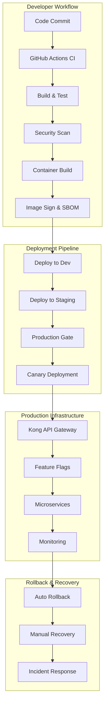

# DevOps & CI/CD - MTN Admission System

## Overview

Complete DevOps implementation for the MTN Admission System microservices architecture, featuring automated CI/CD pipelines, canary deployments, feature flags, and comprehensive monitoring.

## 🏗️ Architecture



## 📁 Repository Structure

```
Admision_MTN_backend/
├── docs/                           # Documentation
│   ├── CI_CD_STRATEGY.md          # Complete CI/CD strategy
│   ├── RELEASE_STRATEGY.md        # Release management
│   ├── ROLLBACK_PROCEDURES.md     # Rollback procedures
│   ├── data_ownership.md          # Data architecture
│   └── observability_strategy.md  # Monitoring strategy
├── template-repo/                  # Service template
│   ├── .github/workflows/         # GitHub Actions
│   │   ├── ci.yml                 # Build & test pipeline
│   │   ├── image.yml              # Container build pipeline
│   │   ├── scan.yml               # Security scanning
│   │   └── deploy.yml             # Deployment pipeline
│   └── helm/                      # Helm charts
│       └── <service>/
│           ├── templates/         # Kubernetes manifests
│           ├── values.yaml        # Default values
│           ├── values-dev.yaml    # Development config
│           ├── values-staging.yaml # Staging config
│           └── values-prod.yaml   # Production config
├── api-gateway/                    # API Gateway & Feature Flags
│   ├── kong-gateway.yaml         # Kong configuration
│   ├── feature-flag-service.yaml # Feature flag service
│   ├── traffic-routing-controller.yaml # Traffic controller
│   ├── monitoring-dashboard.yaml # Grafana dashboards
│   └── setup-gateway.sh          # Setup script
├── shared-libs/                   # Shared libraries
│   ├── event-schema-registry/     # Event schema management
│   ├── event-inbox/              # Idempotency patterns
│   ├── event-outbox/             # Reliable messaging
│   └── saga-orchestration/       # Distributed transactions
└── scripts/                       # Utility scripts
    ├── emergency-rollback.sh      # Emergency procedures
    ├── validate-rollback.sh       # Validation scripts
    └── setup-monitoring.sh        # Monitoring setup
```

## 🚀 Getting Started

### Prerequisites

```bash
# Required tools
kubectl >= 1.28
helm >= 3.12
docker >= 24.0
argo-rollouts >= 1.6

# Optional tools
k9s           # Kubernetes CLI
stern         # Multi-pod log tailing
kubectx       # Context switching
```

### Quick Setup

1. **Clone and Setup**
   ```bash
   git clone https://github.com/mtn-org/admision-backend.git
   cd admision-backend
   chmod +x api-gateway/setup-gateway.sh
   chmod +x scripts/*.sh
   ```

2. **Deploy API Gateway**
   ```bash
   ./api-gateway/setup-gateway.sh
   ```

3. **Deploy a Microservice**
   ```bash
   # Copy template for new service
   cp -r template-repo user-service
   cd user-service
   
   # Customize values
   sed -i 's/<service>/user-service/g' helm/user-service/values.yaml
   
   # Deploy
   helm install user-service helm/user-service -n production
   ```

## 🔄 CI/CD Pipelines

### GitHub Actions Workflows

#### 1. CI Pipeline (`ci.yml`)
**Triggers:** Push to main, develop, feature branches
```yaml
jobs:
  test:
    runs-on: ubuntu-latest
    steps:
      - uses: actions/checkout@v4
      - name: Run tests
        run: mvn test
      - name: SonarQube scan
        run: mvn sonar:sonar
```

**Features:**
- ✅ Unit & integration testing
- ✅ Code quality analysis (SonarQube)
- ✅ Security scanning (OWASP, TruffleHog)
- ✅ Test coverage reporting
- ✅ Dependency vulnerability scanning

#### 2. Image Pipeline (`image.yml`)
**Triggers:** Successful CI completion
```yaml
jobs:
  build-and-push:
    runs-on: ubuntu-latest
    steps:
      - name: Build multi-arch image
        run: docker buildx build --platform linux/amd64,linux/arm64
      - name: Sign image with Cosign
        run: cosign sign --yes $IMAGE_URI
      - name: Generate SBOM
        run: syft $IMAGE_URI -o cyclonedx-json
```

**Features:**
- 🐳 Multi-platform container builds
- 🔐 Image signing with Cosign
- 📋 SBOM generation with Syft
- 🔍 Container security scanning
- 🏷️ Semantic versioning

#### 3. Deploy Pipeline (`deploy.yml`)
**Triggers:** Manual approval, automated for dev/staging
```yaml
jobs:
  deploy-production:
    environment: production
    steps:
      - name: Deploy with Argo Rollouts
        run: kubectl apply -f k8s/
      - name: Monitor canary
        run: kubectl argo rollouts wait user-service
```

**Features:**
- 🎯 Canary deployments with Argo Rollouts
- 📊 Automated metric analysis
- 🔄 Automatic rollback on failure
- 🚀 Zero-downtime deployments

## 🎛️ Feature Flags & Traffic Routing

### Kong API Gateway Configuration

The system uses Kong Gateway with advanced feature flags for controlled traffic routing:

```yaml
# Feature flag example
feature_flags:
  user_service_routing:
    enabled: true
    rollout_percentage: 100
    canary_percentage: 0
    targeting:
      user_roles: ["ADMIN", "TEACHER"]
      beta_users: true
```

### Traffic Routing Rules

```yaml
routing_rules:
  user-service:
    paths: ["/api/users/**", "/api/auth/**"]
    weight: 100        # 100% to microservice
    canary_weight: 0   # 0% to canary version
    
  admision-monolith:
    paths: ["/api/legacy/**"]
    weight: 0          # 0% to legacy monolith
```

### Feature Flag Management

```bash
# Enable canary deployment
curl -X PATCH http://feature-flag-service:8080/api/flags/user_service_routing \
  -H "Authorization: Bearer $API_KEY" \
  -d '{"canary_percentage": 10}'

# Emergency traffic cutoff
curl -X PATCH http://feature-flag-service:8080/api/flags/user_service_routing \
  -H "Authorization: Bearer $EMERGENCY_API_KEY" \
  -d '{"enabled": false, "rollout_percentage": 0}'
```

## 📊 Monitoring & Observability

### Metrics Collection

**Application Metrics:**
- Business KPIs (applications processed, success rates)
- Performance metrics (latency, throughput)
- Error rates and exception tracking
- Resource utilization (CPU, memory)

**Infrastructure Metrics:**
- Kubernetes cluster health
- Node resource usage
- Network performance
- Storage metrics

### Distributed Tracing

OpenTelemetry integration for end-to-end request tracing:

```yaml
tracing:
  enabled: true
  jaeger_endpoint: "http://jaeger-collector:14268/api/traces"
  sampling_rate: 0.1
```

### Alerting Rules

```yaml
# Critical alerts (PagerDuty)
- alert: ServiceDown
  expr: up{job="user-service"} == 0
  for: 1m
  
- alert: HighErrorRate  
  expr: rate(http_requests_total{status=~"5.."}[5m]) / rate(http_requests_total[5m]) > 0.01
  for: 2m

# Warning alerts (Slack)
- alert: HighLatency
  expr: histogram_quantile(0.99, rate(http_request_duration_seconds_bucket[5m])) > 1.0
  for: 5m
```

## 🔄 Canary Deployment Process

### Automated Canary Rollout

1. **Phase 1: Internal (1% - 5 minutes)**
   - Target: MTN staff only
   - Validation: Basic health checks

2. **Phase 2: Limited (5% - 15 minutes)**
   - Target: Beta users
   - Validation: Error rate < 0.1%

3. **Phase 3: Broader (25% - 30 minutes)**
   - Target: Random sample
   - Validation: Business metrics stable

4. **Phase 4: Full (100% - 60 minutes)**
   - Target: All users
   - Validation: Complete system health

### Analysis Templates

```yaml
# Success rate analysis
successCondition: |
  (sum(rate(http_requests_total{status!~"5.."}[2m])) /
   sum(rate(http_requests_total[2m]))) >= 0.99

# Latency analysis
successCondition: |
  histogram_quantile(0.99,
    sum(rate(http_request_duration_seconds_bucket[2m])) by (le)
  ) <= 0.5
```

## 🔒 Security & Compliance

### Container Security

- **Distroless base images** for minimal attack surface
- **Non-root user execution** with security contexts
- **Image vulnerability scanning** with Trivy
- **Runtime security** with Falco

### Supply Chain Security

- **Image signing** with Cosign and keyless OIDC
- **SBOM generation** for dependency tracking
- **Policy enforcement** with OPA Gatekeeper
- **Admission controllers** for security validation

### Data Protection

- **Encryption at rest** with sealed secrets
- **Encryption in transit** with TLS everywhere
- **RBAC implementation** with least privilege
- **Audit logging** for compliance

## 🚨 Rollback Procedures

### Automatic Rollback Triggers

```yaml
rollback_conditions:
  error_rate:
    threshold: 0.05    # 5% error rate
    duration: 2m
  latency:
    p99_threshold: 2000 # 2 seconds
    duration: 3m
  availability:
    threshold: 0.995   # 99.5% availability
    duration: 1m
```

### Emergency Rollback

```bash
# Immediate traffic cutoff (< 30 seconds)
./scripts/emergency-rollback.sh user-service production

# Argo Rollouts rollback (< 2 minutes)  
kubectl argo rollouts abort user-service -n production
kubectl argo rollouts undo user-service -n production

# Validate rollback
./scripts/validate-rollback.sh user-service production
```

### Recovery Validation

- ✅ Health endpoint responses
- ✅ Database connectivity
- ✅ External API integration
- ✅ End-to-end smoke tests
- ✅ Business metric restoration

## 📈 Performance & Scalability

### Auto-scaling Configuration

```yaml
autoscaling:
  enabled: true
  minReplicas: 2
  maxReplicas: 50
  targetCPUUtilizationPercentage: 70
  targetMemoryUtilizationPercentage: 80
  behavior:
    scaleUp:
      stabilizationWindowSeconds: 60
      policies:
      - type: Percent
        value: 100
        periodSeconds: 15
```

### Performance Targets

- **Uptime:** 99.9% SLA
- **Response Time:** < 500ms (P95)
- **Throughput:** 10,000 concurrent users
- **Recovery Time:** < 30 minutes (MTTR)
- **Data Loss:** < 1 hour (RPO)

## 🔧 Operational Runbooks

### Common Operations

```bash
# Deploy new service
./scripts/deploy-service.sh user-service v2.1.0 production

# Scale service
kubectl scale deployment user-service --replicas=10 -n production

# Check service health
curl -f http://user-service.production.svc.cluster.local:8080/actuator/health

# View logs
kubectl logs -f deployment/user-service -n production

# Port forward for debugging
kubectl port-forward svc/user-service 8080:8080 -n production
```

### Troubleshooting

```bash
# Check pod status
kubectl get pods -n production -l app=user-service

# Describe failing pod
kubectl describe pod user-service-xxx -n production

# Check recent events
kubectl get events -n production --sort-by='.lastTimestamp'

# Check resource usage
kubectl top pods -n production
kubectl top nodes
```

## 📚 Documentation

- **[CI/CD Strategy](docs/CI_CD_STRATEGY.md)** - Complete pipeline documentation
- **[Release Strategy](docs/RELEASE_STRATEGY.md)** - Release management processes
- **[Rollback Procedures](docs/ROLLBACK_PROCEDURES.md)** - Comprehensive rollback guide
- **[Data Architecture](docs/data_ownership.md)** - Microservices data patterns
- **[Observability](docs/observability_strategy.md)** - Monitoring and logging

## 🎯 Key Features

✅ **Zero-downtime deployments** with canary rollouts  
✅ **Automated rollback** on metric threshold breaches  
✅ **Feature flags** for controlled traffic routing  
✅ **Multi-environment** progression (dev → staging → prod)  
✅ **Security scanning** at every pipeline stage  
✅ **Image signing** with Cosign for supply chain security  
✅ **SBOM generation** for dependency tracking  
✅ **Comprehensive monitoring** with Prometheus/Grafana  
✅ **Distributed tracing** with Jaeger  
✅ **Database-per-service** architecture  
✅ **Event-driven communication** with RabbitMQ  
✅ **Saga orchestration** for distributed transactions  

## 🚀 Production Readiness

This DevOps implementation provides enterprise-grade:

- **High Availability** - Multi-region deployment support
- **Disaster Recovery** - Automated backup and restore procedures  
- **Security Compliance** - Chilean data protection law compliance
- **Scalability** - Auto-scaling from 2-50 replicas per service
- **Observability** - Complete metrics, logging, and tracing
- **Reliability** - 99.9% uptime SLA with automated recovery

## 📞 Support & Maintenance

- **DevOps Team:** `#devops-support` (Slack)
- **On-Call Engineer:** PagerDuty escalation for P0/P1 incidents
- **Documentation:** Updated with every release
- **Training:** Monthly DevOps training sessions
- **Runbooks:** Available at https://runbooks.mtn.cl

---

**Colegio Monte Tabor y Nazaret - DevOps Engineering Team**  
*Enabling reliable, scalable, and secure educational technology*