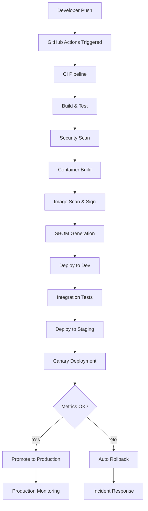

# CI/CD Strategy - MTN Admission System Microservices

## Overview

This document outlines the complete CI/CD strategy for the MTN Admission System microservices architecture, including build processes, deployment strategies, canary rollouts, and rollback procedures.

## Architecture Components

### 1. Repository Structure
```
mtn-org/
├── user-service/              # User management microservice
├── application-service/       # Application processing microservice  
├── evaluation-service/        # Evaluation and interview management
├── notification-service/      # Email and notification service
├── shared-libs/              # Shared libraries and utilities
└── template-repo/            # Template for new services
```

### 2. CI/CD Pipeline Architecture



## CI Pipeline (Continuous Integration)

### Build Pipeline (`ci.yml`)

**Triggers:**
- Push to `main`, `develop`, `feature/*`
- Pull requests to `main`, `develop`
- Scheduled runs (daily security scans)

**Stages:**
1. **Code Quality**
   - Linting (ESLint, Checkstyle)
   - Code formatting validation
   - Dependency vulnerability scanning

2. **Testing**
   - Unit tests with coverage (minimum 80%)
   - Integration tests
   - Contract testing (Pact)
   - Performance baseline tests

3. **Security Analysis**
   - SAST with SonarQube
   - Dependency scanning with OWASP
   - Secret detection with TruffleHog
   - License compliance check

4. **Build Artifacts**
   - Compile application (Maven/Gradle)
   - Generate test reports
   - Create deployment manifests

**Quality Gates:**
- Test coverage ≥ 80%
- Security vulnerability score ≥ A
- Performance regression < 5%
- All tests must pass

### Container Image Pipeline (`image.yml`)

**Triggers:**
- Successful CI pipeline completion
- Manual trigger for hotfixes
- Scheduled rebuilds for base image updates

**Process:**
1. **Multi-stage Docker Build**
   ```dockerfile
   # Build stage
   FROM maven:3.9-openjdk-17 as builder
   COPY . /app
   WORKDIR /app
   RUN mvn clean package -DskipTests
   
   # Runtime stage
   FROM gcr.io/distroless/java17-debian11:nonroot
   COPY --from=builder /app/target/*.jar /app.jar
   EXPOSE 8080
   ENTRYPOINT ["java", "-jar", "/app.jar"]
   ```

2. **Multi-platform Build**
   - linux/amd64 (primary)
   - linux/arm64 (Apple Silicon support)

3. **Security Hardening**
   - Distroless base images
   - Non-root user execution
   - Minimal attack surface
   - Read-only filesystem

4. **Image Analysis**
   - Trivy vulnerability scanning
   - Grype binary analysis
   - Image layer optimization
   - Size optimization verification

5. **SBOM Generation**
   - Syft for comprehensive SBOM
   - CycloneDX format compatibility
   - Dependency graph analysis
   - License information extraction

6. **Image Signing**
   - Cosign with OIDC keyless signing
   - GitHub OIDC identity verification
   - Transparency log integration
   - Supply chain attestation

## CD Pipeline (Continuous Deployment)

### Deployment Pipeline (`deploy.yml`)

**Environment Progression:**
```
Development → Staging → Production
     ↓           ↓          ↓
   Auto        Auto    Manual Gate
```

**Deployment Stages:**

#### 1. Development Deployment
- **Trigger:** Successful image build
- **Strategy:** Rolling deployment (immediate)
- **Validation:** Health checks, smoke tests
- **Rollback:** Automatic on failure

#### 2. Staging Deployment  
- **Trigger:** Dev deployment success
- **Strategy:** Blue-green deployment
- **Validation:** Full test suite, performance tests
- **Duration:** Soak testing for 30 minutes
- **Rollback:** Automatic on quality gate failure

#### 3. Production Deployment
- **Trigger:** Manual approval after staging validation
- **Strategy:** Canary deployment with Argo Rollouts
- **Validation:** Real-time metrics analysis
- **Rollback:** Automatic on metric thresholds

### Canary Deployment Strategy

#### Phase 1: Initial Canary (5%)
```yaml
steps:
  - setWeight: 5
  - pause: { duration: 5m }
  - analysis:
      templates:
        - templateName: success-rate
        - templateName: latency-p99
      successCondition: result[0] >= 0.99
      failureLimit: 1
```

**Metrics Monitored:**
- Success rate ≥ 99%
- P99 latency ≤ 500ms
- Error rate ≤ 0.01%
- CPU usage ≤ 80%
- Memory usage ≤ 90%

#### Phase 2: Gradual Rollout
- **10%** → Wait 10min → Analyze
- **25%** → Wait 15min → Analyze  
- **50%** → Wait 20min → Analyze
- **100%** → Complete deployment

**Analysis Templates:**
```yaml
# Success Rate Analysis
successCondition: |
  (sum(rate(http_requests_total{status!~"5.."}[2m])) /
   sum(rate(http_requests_total[2m]))) >= 0.99

# Latency Analysis  
successCondition: |
  histogram_quantile(0.99,
    sum(rate(http_request_duration_seconds_bucket[2m])) by (le)
  ) <= 0.5
```

### Feature Flags Integration

**Traffic Routing Control:**
```yaml
feature_flags:
  user_service_routing:
    enabled: true
    rollout_percentage: 100
    canary_percentage: 0
    targeting:
      user_roles: ["ADMIN", "TEACHER"]
      beta_users: true
```

**Dynamic Routing:**
- Real-time traffic split adjustment
- User-based targeting (role, beta status)
- Geographic routing capability
- A/B testing integration

## Rollback Strategies

### Automatic Rollback Triggers

1. **Metric-based Rollback**
   - Success rate drops below 99%
   - P99 latency exceeds 1000ms
   - Error rate exceeds 1%
   - CPU usage exceeds 95%

2. **Health Check Failures**
   - Readiness probe failures > 3
   - Liveness probe failures > 3
   - External dependency failures

3. **Business Logic Failures**
   - Critical API endpoint failures
   - Database connection issues
   - Message queue problems

### Manual Rollback Procedures

#### 1. Emergency Rollback (< 5 minutes)
```bash
# Using Argo Rollouts
kubectl argo rollouts abort user-service -n production
kubectl argo rollouts undo user-service -n production

# Using Feature Flags (Immediate)
curl -X PATCH http://feature-flag-service:8080/api/flags/user_service_routing \
  -H "Authorization: Bearer $API_KEY" \
  -d '{"canary_percentage": 0, "rollout_percentage": 0}'
```

#### 2. Standard Rollback (< 10 minutes)
```bash
# Helm-based rollback
helm rollback user-service -n production

# Verify rollback
kubectl get pods -n production -l app=user-service
kubectl logs -f deployment/user-service -n production
```

#### 3. Complete Infrastructure Rollback
```bash
# Multi-service coordinated rollback
./scripts/emergency-rollback.sh --services=user,application,evaluation
```

### Rollback Validation

**Post-Rollback Checks:**
1. Health endpoint responses (< 30s)
2. Database connectivity tests
3. Message queue connectivity
4. External API integration tests  
5. End-to-end smoke tests

**Monitoring During Rollback:**
- Error rate normalization
- Response time improvement
- Resource utilization stabilization
- User experience metrics

## Security and Compliance

### Supply Chain Security

1. **Image Signing and Verification**
   - Cosign keyless signing with OIDC
   - Admission controller signature verification
   - Policy enforcement with Gatekeeper

2. **SBOM Management**
   - Automated SBOM generation
   - Vulnerability database correlation
   - License compliance tracking
   - Dependency update notifications

3. **Runtime Security**
   - Pod Security Standards enforcement
   - Network policies with zero-trust
   - RBAC with least privilege
   - Security context constraints

### Compliance Requirements

**Data Protection (Chilean Personal Data Law 19.628):**
- Encrypted data at rest and in transit
- Access logging and audit trails
- Data retention policy enforcement
- Privacy-by-design implementation

**Educational Compliance:**
- Student data protection measures
- Parental consent management
- Academic record confidentiality
- Secure document handling

## Monitoring and Observability

### Metrics Collection

**Application Metrics:**
- Business metrics (applications processed, evaluations completed)
- Performance metrics (response times, throughput)
- Error metrics (failure rates, exception counts)
- Resource metrics (CPU, memory, disk usage)

**Infrastructure Metrics:**
- Kubernetes cluster health
- Node resource utilization
- Network traffic patterns
- Storage performance

### Distributed Tracing

**OpenTelemetry Integration:**
```yaml
tracing:
  enabled: true
  jaeger:
    endpoint: http://jaeger-collector.monitoring:14268/api/traces
  sampling_rate: 0.1
  service_name: ${SERVICE_NAME}
```

**Trace Context Propagation:**
- Cross-service request tracking
- Performance bottleneck identification
- Error correlation across services
- User journey mapping

### Alerting Strategy

**Critical Alerts (Immediate Response):**
- Service down (PagerDuty)
- High error rate (> 1%)
- Database connectivity issues
- Security breaches

**Warning Alerts (Business Hours):**
- High latency (> 1s)
- Resource utilization (> 80%)
- Slow database queries
- Feature flag configuration changes

## Disaster Recovery

### Backup Strategy

1. **Database Backups**
   - Automated daily full backups
   - Hourly incremental backups
   - Cross-region replication
   - Point-in-time recovery capability

2. **Configuration Backups**
   - Kubernetes manifests versioning
   - Secret management with external secrets
   - Feature flag configuration snapshots
   - Infrastructure as code state

### Recovery Procedures

**RTO/RPO Targets:**
- RTO (Recovery Time Objective): 30 minutes
- RPO (Recovery Point Objective): 1 hour

**Recovery Scenarios:**
1. Single service failure → Automatic failover
2. Database failure → Switch to replica
3. Cluster failure → Multi-region deployment
4. Complete datacenter failure → Disaster recovery site

### Business Continuity

**Degraded Mode Operations:**
- Read-only mode for applications
- Cached data serving capability
- Essential services prioritization
- User communication protocols

## Release Management

### Release Types

1. **Feature Releases**
   - Monthly scheduled releases
   - Full canary deployment process
   - Comprehensive testing required
   - Stakeholder approval needed

2. **Hotfix Releases**
   - Emergency bug fixes
   - Expedited approval process
   - Direct-to-staging deployment
   - Enhanced monitoring post-deployment

3. **Security Releases**
   - Critical security patches
   - Zero-downtime deployment required
   - Immediate production rollout
   - Security team validation

### Change Management

**Release Planning:**
- Feature freeze 1 week before release
- Stakeholder review and approval
- Rollback plan documentation
- Communication plan execution

**Post-Release:**
- Metrics validation (24-48 hours)
- User feedback collection
- Performance impact assessment
- Lessons learned documentation

## Performance and Scalability

### Load Testing Strategy

**Pre-Production Testing:**
- Staging environment load testing
- Performance regression testing
- Capacity planning validation
- Scalability limit identification

**Production Validation:**
- Gradual traffic increase during canary
- Real-time performance monitoring
- Automatic scaling verification
- Resource utilization optimization

### Scalability Metrics

**Target Performance:**
- 99.9% uptime SLA
- < 500ms average response time
- Support for 10,000 concurrent users
- Auto-scaling from 2-50 replicas

**Monitoring Thresholds:**
- CPU utilization: 70% (scale up), 30% (scale down)
- Memory utilization: 80% (scale up), 40% (scale down)
- Request queue length: 100 (scale up)
- Response time: 1000ms (alert)

This CI/CD strategy ensures reliable, secure, and scalable deployment of the MTN Admission System microservices while maintaining high availability and rapid recovery capabilities.