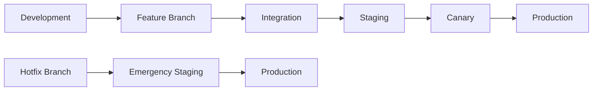

# Release Strategy - MTN Admission System

## Release Management Framework

### Release Philosophy

The MTN Admission System follows a **"Ship Small, Ship Often"** philosophy with:
- **Zero-downtime deployments** for all production changes
- **Gradual rollouts** to minimize risk and impact
- **Automated quality gates** to ensure reliability
- **Fast rollback capability** for rapid recovery

### Release Categories

#### 1. Major Releases (Quarterly)
- **Scope:** New features, architectural changes, major improvements
- **Timeline:** 12-week development cycle
- **Testing:** Full regression testing, performance validation
- **Approval:** Stakeholder review, product owner sign-off
- **Deployment:** Canary deployment over 2-3 days

#### 2. Minor Releases (Bi-weekly)  
- **Scope:** Feature enhancements, non-breaking changes
- **Timeline:** 2-week sprint cycle
- **Testing:** Automated testing, staging validation
- **Approval:** Technical lead approval
- **Deployment:** Canary deployment over 24 hours

#### 3. Patch Releases (As needed)
- **Scope:** Bug fixes, security patches, critical issues
- **Timeline:** Emergency or weekly maintenance windows
- **Testing:** Targeted testing for affected components
- **Approval:** Technical lead or emergency approval
- **Deployment:** Accelerated canary or direct deployment

#### 4. Hotfix Releases (Emergency)
- **Scope:** Critical production issues, security vulnerabilities
- **Timeline:** Immediate (< 4 hours)
- **Testing:** Focused testing, production validation
- **Approval:** Emergency change approval board
- **Deployment:** Direct to production with enhanced monitoring

## Release Pipeline Architecture

### Environment Progression



### Environment Specifications

#### Development Environment
- **Purpose:** Developer testing and integration
- **Data:** Synthetic test data
- **Deployment:** Automatic on merge to develop
- **Rollback:** Automatic on failure
- **Monitoring:** Basic health checks

#### Staging Environment
- **Purpose:** Production-like validation
- **Data:** Anonymized production data subset
- **Deployment:** Automatic after dev validation
- **Duration:** 24-hour soak testing
- **Rollback:** Automatic on quality gate failure

#### Production Environment
- **Purpose:** Live user traffic
- **Data:** Real production data
- **Deployment:** Canary with manual gates
- **Monitoring:** Comprehensive observability
- **Rollback:** Automated + manual triggers

## Canary Deployment Strategy

### Progressive Rollout Phases

#### Phase 1: Internal Canary (1% - 5 minutes)
**Target Audience:** MTN staff, beta testers
```yaml
canary:
  weight: 1
  duration: 5m
  targeting:
    headers:
      - "X-MTN-Staff: true"
    user_roles: ["ADMIN", "STAFF"]
```

**Success Criteria:**
- Zero critical errors
- Response time < 500ms
- All health checks passing

#### Phase 2: Limited Canary (5% - 15 minutes)
**Target Audience:** Power users, early adopters
```yaml
canary:
  weight: 5
  duration: 15m
  targeting:
    user_attributes:
      - beta_user: true
      - early_adopter: true
```

**Success Criteria:**
- Error rate < 0.1%
- Success rate > 99.9%
- No user-reported issues

#### Phase 3: Broader Canary (25% - 30 minutes)
**Target Audience:** Random user sample
```yaml
canary:
  weight: 25
  duration: 30m
  targeting:
    sampling: random
    criteria:
      - active_users: true
```

**Success Criteria:**
- Error rate < 0.01%
- Latency p95 < 750ms
- Business metrics stable

#### Phase 4: Production Rollout (100% - 60 minutes)
**Target Audience:** All users
```yaml
canary:
  weight: 100
  duration: 60m
  monitoring:
    enhanced: true
    alerting: strict
```

**Success Criteria:**
- All metrics within normal ranges
- No degradation in user experience
- System stability maintained

### Automated Analysis Templates

#### Success Rate Analysis
```yaml
apiVersion: argoproj.io/v1alpha1
kind: AnalysisTemplate
metadata:
  name: success-rate-analysis
spec:
  metrics:
  - name: success-rate
    interval: 30s
    count: 10
    successCondition: result[0] >= 0.999
    failureLimit: 2
    provider:
      prometheus:
        address: http://prometheus:9090
        query: |
          sum(rate(http_requests_total{status!~"5.."}[2m])) /
          sum(rate(http_requests_total[2m]))
```

#### Latency Analysis
```yaml
metrics:
- name: latency-p99
  successCondition: result[0] <= 1.0
  query: |
    histogram_quantile(0.99,
      sum(rate(http_request_duration_seconds_bucket[2m])) by (le)
    )
```

#### Business Metrics Analysis
```yaml
metrics:
- name: application-submission-rate
  successCondition: result[0] >= baseline * 0.95
  query: |
    rate(applications_submitted_total[5m])
```

## Rollback Procedures

### Automatic Rollback Triggers

#### Metric-Based Triggers
```yaml
rollback_conditions:
  error_rate:
    threshold: 0.05  # 5% error rate
    duration: 2m
  latency:
    p99_threshold: 2000  # 2 seconds
    duration: 3m
  availability:
    threshold: 0.995  # 99.5% availability
    duration: 1m
```

#### Health Check Triggers
- **Readiness Probe Failures:** > 50% of pods failing for 2 minutes
- **Liveness Probe Failures:** > 25% of pods failing for 1 minute
- **External Dependency Failures:** Critical services unreachable

#### Business Logic Triggers
- **Authentication Service:** Login success rate < 99%
- **Application Submission:** Success rate < 98%
- **Document Upload:** Failure rate > 2%

### Manual Rollback Procedures

#### Emergency Rollback (< 2 minutes)
```bash
#!/bin/bash
# Emergency rollback script
SERVICE_NAME=$1
NAMESPACE=${2:-production}

echo "🚨 EMERGENCY ROLLBACK: $SERVICE_NAME"

# Immediate traffic cutoff via feature flags
curl -X PATCH http://feature-flag-service:8080/api/flags/${SERVICE_NAME}_routing \
  -H "Authorization: Bearer $EMERGENCY_API_KEY" \
  -d '{"enabled": false, "rollout_percentage": 0}'

# Argo Rollouts abort and undo
kubectl argo rollouts abort $SERVICE_NAME -n $NAMESPACE
kubectl argo rollouts undo $SERVICE_NAME -n $NAMESPACE

# Verify rollback
kubectl get rollout $SERVICE_NAME -n $NAMESPACE
kubectl logs -f rollout/$SERVICE_NAME -n $NAMESPACE

echo "✅ Emergency rollback completed"
```

#### Staged Rollback (< 10 minutes)
```bash
#!/bin/bash
# Staged rollback with validation
SERVICE_NAME=$1
TARGET_REVISION=${2:-previous}

# Gradual traffic reduction
for weight in 75 50 25 0; do
  echo "Reducing traffic to $weight%"
  kubectl argo rollouts set-weight $SERVICE_NAME $weight -n production
  sleep 30
  
  # Check metrics during reduction
  if ! ./scripts/validate-metrics.sh $SERVICE_NAME; then
    echo "⚠️  Metrics validation failed during rollback"
  fi
done

# Complete rollback to stable version
kubectl argo rollouts undo $SERVICE_NAME -n production --to-revision=$TARGET_REVISION
```

### Rollback Validation

#### Automated Validation Checks
```yaml
validation_steps:
  1_health_checks:
    timeout: 60s
    endpoints:
      - /actuator/health
      - /actuator/health/liveness
      - /actuator/health/readiness
  
  2_functional_tests:
    timeout: 180s
    tests:
      - authentication_flow
      - application_submission
      - document_upload
      - evaluation_workflow
  
  3_performance_baseline:
    timeout: 300s
    metrics:
      - response_time_p95
      - error_rate
      - throughput
```

#### Manual Validation Checklist
- [ ] All critical endpoints responding
- [ ] Database connectivity restored
- [ ] External integrations working
- [ ] User authentication functional
- [ ] Core business flows operational
- [ ] No data corruption detected
- [ ] Monitoring alerts cleared

## Feature Flag Strategy

### Flag Types and Usage

#### 1. Release Flags (Temporary)
**Purpose:** Control feature rollout and enable safe deployment
```json
{
  "new_evaluation_workflow": {
    "type": "release",
    "enabled": true,
    "rollout_percentage": 25,
    "targeting": {
      "user_roles": ["TEACHER", "COORDINATOR"],
      "schools": ["MONTE_TABOR"]
    },
    "expiry": "2024-03-01"
  }
}
```

#### 2. Operational Flags (Long-lived)
**Purpose:** Control system behavior and operational features
```json
{
  "enhanced_logging": {
    "type": "operational",
    "enabled": true,
    "targeting": {
      "environments": ["production"],
      "service_versions": [">=2.1.0"]
    }
  }
}
```

#### 3. Permission Flags (User-based)
**Purpose:** Control user access to features
```json
{
  "advanced_reporting": {
    "type": "permission",
    "enabled": true,
    "targeting": {
      "user_roles": ["ADMIN", "CYCLE_DIRECTOR"],
      "permissions": ["REPORTS_VIEW"]
    }
  }
}
```

#### 4. Experiment Flags (A/B Testing)
**Purpose:** Support experimentation and data-driven decisions
```json
{
  "new_ui_design": {
    "type": "experiment",
    "enabled": true,
    "variants": {
      "control": 50,
      "treatment": 50
    },
    "metrics": ["conversion_rate", "user_satisfaction"]
  }
}
```

### Flag Management Workflow

#### Flag Lifecycle
1. **Planning:** Feature flag requirements defined
2. **Implementation:** Flag integrated into code
3. **Testing:** Flag tested in development/staging
4. **Rollout:** Gradual enabling in production
5. **Monitoring:** Performance and business metrics tracked
6. **Cleanup:** Flag removed after full rollout

#### Flag Governance
- **Flag Review:** Weekly review of active flags
- **Expiry Management:** Automatic flag expiration
- **Performance Impact:** Regular flag performance assessment
- **Technical Debt:** Quarterly flag cleanup initiatives

## Release Communication

### Stakeholder Communication Plan

#### Pre-Release (1 week)
**Audience:** All stakeholders
**Content:**
- Release scope and timeline
- Expected user impact
- Rollback procedures
- Support contact information

#### During Release
**Audience:** Technical teams, support staff
**Content:**
- Real-time deployment status
- Metrics and performance data
- Issue reporting channels
- Escalation procedures

#### Post-Release (24-48 hours)
**Audience:** All stakeholders
**Content:**
- Deployment completion status
- Performance validation results
- User feedback summary
- Next steps and follow-up actions

### Release Notes Template

```markdown
# Release v2.4.0 - Enhanced Evaluation Workflow

## 🚀 New Features
- **Advanced Evaluation Forms:** Customizable evaluation templates
- **Real-time Collaboration:** Multiple evaluators can work simultaneously
- **Mobile Optimization:** Improved mobile interface for evaluations

## 🔧 Improvements
- **Performance:** 40% faster evaluation loading times
- **Accessibility:** WCAG 2.1 AA compliance improvements
- **Security:** Enhanced authentication for sensitive operations

## 🐛 Bug Fixes
- Fixed issue with evaluation form autosave
- Resolved date picker timezone handling
- Corrected email notification delivery delays

## 📊 Metrics & Impact
- **Deployment Duration:** 45 minutes (canary rollout)
- **Performance Improvement:** P95 latency reduced by 200ms
- **Error Rate:** Maintained <0.01% throughout deployment
- **User Experience:** No service interruptions reported

## 🔄 Rollback Plan
- **Trigger Conditions:** Error rate >1%, P95 latency >2s
- **Rollback Time:** <5 minutes via feature flags
- **Validation:** Automated health checks and manual verification

## 📞 Support
- **Technical Issues:** DevOps team (Slack: #devops-support)
- **Business Questions:** Product team (Slack: #product-support)
- **Emergency:** On-call engineer (PagerDuty escalation)
```

## Quality Gates and Approvals

### Automated Quality Gates

#### Code Quality
- **Test Coverage:** Minimum 80%
- **Code Complexity:** Cyclomatic complexity < 10
- **Security Scan:** No high/critical vulnerabilities
- **License Compliance:** All dependencies approved

#### Performance Gates
- **Load Testing:** 99th percentile <1s under 2x normal load
- **Memory Usage:** <80% of allocated resources
- **Startup Time:** <30 seconds from deployment
- **Database Performance:** Query time <100ms for 95% of queries

### Manual Approval Gates

#### Development to Staging
- **Approver:** Tech Lead
- **Criteria:** All automated tests pass, feature complete
- **SLA:** 4 hours maximum hold time

#### Staging to Production
- **Approver:** Product Owner + Tech Lead
- **Criteria:** Business acceptance, performance validation
- **SLA:** 24 hours maximum hold time

#### Emergency Releases
- **Approver:** On-call manager or designated emergency approver
- **Criteria:** Critical issue resolution, limited scope
- **SLA:** 1 hour maximum approval time

## Metrics and KPIs

### Deployment Metrics

#### Frequency Metrics
- **Deployment Frequency:** Target 2x per week
- **Lead Time:** From commit to production <24 hours
- **Mean Time to Recovery (MTTR):** <30 minutes
- **Change Failure Rate:** <5% of deployments

#### Quality Metrics
- **Rollback Rate:** <2% of deployments
- **Incident Rate:** <1 incident per 100 deployments
- **Customer Impact:** <0.1% of users affected per deployment
- **Downtime:** Zero downtime target (99.9% uptime)

### Business Impact Metrics

#### User Experience
- **Page Load Times:** <2 seconds for 95% of requests
- **Error Rates:** <0.01% for critical user journeys
- **Feature Adoption:** >70% adoption within 30 days
- **User Satisfaction:** >4.5/5 rating for new features

#### System Performance
- **Throughput:** Support 10,000 concurrent users
- **Resource Efficiency:** <75% CPU/memory utilization
- **Data Consistency:** 100% data integrity maintained
- **Security:** Zero security incidents from deployments

This release strategy ensures reliable, efficient, and user-focused delivery of the MTN Admission System while maintaining high quality and minimal risk.