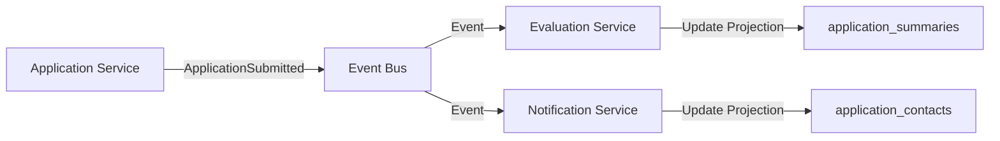

# Política de Propiedad de Datos (Data Ownership)

## Principios Fundamentales

### 1. Database-per-Service
Cada microservicio es propietario único y exclusivo de su base de datos y esquema:

- **application-service**: PostgreSQL `Admision_MTN_DB` - Tablas: `applications`, `students`, `parents`, `guardians`, `supporters`, `users`
- **evaluation-service**: PostgreSQL `evaluations_db` - Tablas: `evaluations`, `interviews`, `outbox`
- **notification-service**: PostgreSQL `notifications_db` - Tablas: `notifications`, `templates`, `delivery_logs`

### 2. Acceso Externo Únicamente por API/Eventos
```
❌ PROHIBIDO: Consultas SQL cross-database
✅ PERMITIDO: API REST/GraphQL + Eventos de dominio
```

### 3. Proyecciones (Read Models)
Cada servicio mantiene **proyecciones locales** de datos externos necesarios:

```
application-service/
├── read-models/
│   ├── evaluator_profiles/     # Datos de evaluators para asignación
│   └── notification_status/    # Estado de notificaciones enviadas

evaluation-service/
├── read-models/
│   ├── application_summaries/  # Datos básicos de aplicaciones
│   └── student_profiles/       # Información académica de estudiantes

notification-service/
├── read-models/
│   ├── user_preferences/       # Preferencias de notificación
│   └── application_contacts/   # Datos de contacto por aplicación
```

## Patrones de Acceso a Datos

### API Composition Pattern
Para consultas que requieren datos de múltiples servicios:

```java
@RestController
public class ApplicationSummaryController {
    
    @GetMapping("/applications/{id}/complete")
    public ApplicationCompleteView getCompleteApplication(@PathVariable UUID id) {
        // 1. Datos propios
        Application app = applicationService.getById(id);
        
        // 2. Datos externos via API
        List<Evaluation> evaluations = evaluationServiceClient.getByApplicationId(id);
        List<Notification> notifications = notificationServiceClient.getByApplicationId(id);
        
        // 3. Composición
        return ApplicationCompleteView.builder()
            .application(app)
            .evaluations(evaluations)
            .notifications(notifications)
            .build();
    }
}
```

### CQRS Ligero con Proyecciones
```java
// En evaluation-service: proyección de datos de aplicación
@Entity
@Table(name = "application_summaries")
public class ApplicationSummary {
    @Id
    private UUID applicationId;
    private String studentName;
    private String educationalLevel;
    private LocalDate birthDate;
    private Instant lastUpdated;
    
    // Actualizada via eventos ApplicationSubmitted/StateChanged
}

@EventListener
public class ApplicationSummaryProjector {
    
    @RabbitListener(queues = "evaluations.application-events.queue")
    public void on(ApplicationSubmittedEvent event) {
        applicationSummaryRepository.save(
            ApplicationSummary.fromEvent(event)
        );
    }
}
```

### Caché de Lectura con TTL
```java
@Service
public class StudentProfileService {
    
    @Cacheable(value = "student-profiles", key = "#studentId")
    @CacheEvict(allEntries = true, condition = "#result.lastUpdated.isBefore(now().minus(1, ChronoUnit.HOURS))")
    public StudentProfile getStudentProfile(UUID studentId) {
        // Llamada a application-service con fallback a caché
        return applicationServiceClient.getStudentProfile(studentId)
            .orElseGet(() -> studentProfileCache.get(studentId));
    }
}
```

## Reglas de Sincronización

### Eventual Consistency


### Invalidación de Proyecciones
```java
@Component
public class ProjectionManager {
    
    @EventListener
    @RabbitListener(queues = "*.application-state-changed.queue")
    public void onApplicationStateChanged(ApplicationStateChangedEvent event) {
        
        // Invalidar cachés relacionados
        cacheManager.evict("application-summaries", event.getApplicationId());
        
        // Actualizar proyecciones asíncronamente  
        CompletableFuture.runAsync(() -> {
            updateApplicationSummary(event);
        });
    }
}
```

## Ownership por Dominio

### Application Domain (application-service)
**OWNS:**
- Estados de aplicaciones (PENDING, UNDER_REVIEW, etc.)
- Datos de estudiantes y familias
- Documentos adjuntos
- Historial de cambios de estado

**EXPOSES:**
- `GET /api/applications/{id}` - Datos completos de aplicación
- `POST /api/applications/{id}/state-change` - Cambio de estado
- Eventos: `ApplicationSubmitted`, `ApplicationStateChanged`

### Evaluation Domain (evaluation-service)
**OWNS:**
- Estados de evaluaciones (PENDING, ASSIGNED, COMPLETED)
- Resultados de evaluaciones académicas/psicológicas
- Programación de entrevistas
- Asignaciones de evaluadores

**EXPOSES:**
- `GET /api/evaluations/application/{id}` - Evaluaciones de una aplicación
- `POST /api/evaluations/{id}/complete` - Completar evaluación
- Eventos: `EvaluationAssigned`, `EvaluationCompleted`, `InterviewScheduled`

### Notification Domain (notification-service)
**OWNS:**
- Plantillas de notificación
- Logs de entrega (email, SMS)
- Preferencias de usuario
- Estado de notificaciones

**EXPOSES:**
- `POST /api/notifications/send` - Enviar notificación
- `GET /api/notifications/{id}/status` - Estado de entrega
- Eventos: `NotificationRequested`, `NotificationDelivered`

## Anti-Patrones a Evitar

### ❌ Shared Database
```sql
-- PROHIBIDO: evaluation-service consultando directamente
SELECT * FROM admision_mtn_db.applications WHERE id = ?;
```

### ❌ Foreign Keys Cross-Service
```sql
-- PROHIBIDO: FK entre bases diferentes
ALTER TABLE evaluations 
ADD CONSTRAINT fk_application 
FOREIGN KEY (application_id) REFERENCES admision_mtn_db.applications(id);
```

### ❌ Distributed Transactions (2PC)
```java
// PROHIBIDO: Transacciones distribuidas
@Transactional
public void processApplication(UUID appId) {
    applicationService.updateState(appId, "UNDER_REVIEW");    // DB1
    evaluationService.createEvaluations(appId);               // DB2
    notificationService.sendWelcome(appId);                   // DB3
}
```

## Métricas de Ownership

```java
@Component
public class DataOwnershipMetrics {
    
    private final MeterRegistry meterRegistry;
    
    @EventListener
    public void onCrossServiceQuery(CrossServiceQueryEvent event) {
        // Alertar sobre violaciones de ownership
        Counter.builder("data.ownership.violations")
            .tag("source.service", event.getSourceService())
            .tag("target.service", event.getTargetService())
            .tag("violation.type", event.getViolationType())
            .register(meterRegistry)
            .increment();
    }
}
```

## Validación en CI/CD

```yaml
# .github/workflows/data-ownership-check.yml
- name: Validate Data Ownership
  run: |
    # Verificar que no hay consultas cross-database
    grep -r "FROM [a-z]*_db\." src/ && exit 1
    
    # Verificar que no hay FKs cross-service
    grep -r "REFERENCES.*\." migrations/ && exit 1
    
    # Validar que APIs respetan boundaries
    ./scripts/validate-service-boundaries.sh
```