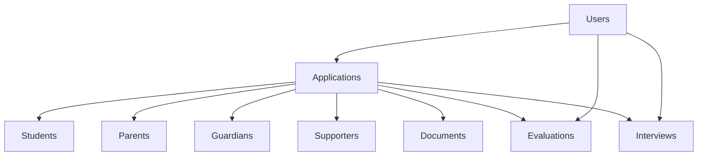

# Data Strategy for MTN Admission System
## Microservices Migration Plan

### Version: 1.0
### Date: 2024-01-15
### Status: Phase 1 - Foundation

---

## 1. Executive Summary

This document outlines the comprehensive data strategy for migrating the MTN Admission System from a monolithic architecture to microservices. The strategy emphasizes **data consistency**, **business continuity**, and **gradual migration** to minimize risks during the transformation.

### Key Objectives
- **Zero Downtime Migration**: Ensure continuous operation during admission periods
- **Data Consistency**: Maintain referential integrity across distributed services  
- **Event-Driven Architecture**: Implement domain events for loose coupling
- **Database per Service**: Achieve true service autonomy with dedicated databases
- **Observability**: Complete tracing of data flows and transactions

---

## 2. Current State Analysis

### Monolithic Database Schema
The current system uses a single PostgreSQL database (`Admisión_MTN_DB`) with the following core entities:

```sql
-- Core business entities
users (id, email, role, educational_level, subject, ...)
applications (id, student_id, father_id, mother_id, status, ...)  
students (id, first_name, last_name, rut, birth_date, grade, ...)
parents (id, first_name, last_name, rut, email, phone, ...)
guardians (id, rut, relationship, email, phone, address, ...)
supporters (id, rut, relationship, income, ...)
documents (id, application_id, document_type, file_path, ...)
evaluations (id, application_id, evaluator_id, score, ...)
interviews (id, application_id, interviewer_id, date, status, ...)
```

### Data Dependencies Analysis


### Current Challenges
- **Tight Coupling**: All services share the same database
- **Scalability Limits**: Single point of failure and performance bottleneck
- **Development Bottlenecks**: Teams cannot work independently on database changes
- **Data Consistency**: ACID transactions span multiple business domains
- **Technology Constraints**: Cannot use specialized databases for different use cases

---

## 3. Target Architecture: Database per Service

### Service Data Ownership

| Service | Database | Primary Entities | External Dependencies |
|---------|----------|------------------|---------------------|
| **User Service** | `user_db` | users, roles, permissions | None (foundational) |
| **Application Service** | `application_db` | applications, workflow_states | User Service |
| **Student Service** | `student_db` | students, families, demographics | User Service |
| **Document Service** | `document_db` | documents, file_metadata | Application, User |
| **Evaluation Service** | `evaluation_db` | evaluations, scores, criteria | Application, User |
| **Interview Service** | `interview_db` | interviews, schedules, feedback | Application, User |
| **Notification Service** | `notification_db` | templates, delivery_log | User Service |

### Database Technology Selection

```yaml
User Service:
  database: PostgreSQL
  rationale: ACID compliance for user management, role-based access
  
Application Service:
  database: PostgreSQL  
  rationale: Complex workflows, state transitions, audit requirements
  
Document Service:
  database: PostgreSQL + Object Storage (MinIO)
  rationale: Metadata in PostgreSQL, files in object storage
  
Evaluation Service:
  database: PostgreSQL
  rationale: Structured scores, complex queries, reporting
  
Interview Service:
  database: PostgreSQL
  rationale: Scheduling constraints, calendar integration
  
Notification Service:
  database: PostgreSQL + Redis (caching)
  rationale: Template storage, delivery tracking, high throughput
```

---

## 4. Migration Strategy: Strangler Fig Pattern

### Phase 1: Foundation (Weeks 1-2)
**Goal**: Containerization + Observability Infrastructure

```yaml
Deliverables:
  - Docker containerization (monolith + frontend)
  - API Gateway with Service Discovery (Eureka)
  - Authentication migration to Keycloak OIDC
  - Observability stack (OpenTelemetry, Prometheus, Grafana, Loki, Jaeger)
  - Event infrastructure setup (RabbitMQ)
  
Database Changes: None
Risk Level: Low
Business Impact: Zero (infrastructure only)
```

### Phase 2: Data Preparation (Weeks 3-4)
**Goal**: Event Infrastructure + Data Replication Setup

```sql
-- Create event store schema
CREATE TABLE domain_events (
    id UUID PRIMARY KEY DEFAULT gen_random_uuid(),
    aggregate_type VARCHAR(100) NOT NULL,
    aggregate_id UUID NOT NULL,
    event_type VARCHAR(100) NOT NULL,
    event_data JSONB NOT NULL,
    event_version INTEGER NOT NULL,
    occurred_at TIMESTAMP DEFAULT NOW(),
    processed_at TIMESTAMP,
    created_by UUID REFERENCES users(id)
);

-- Create outbox pattern for reliable messaging
CREATE TABLE outbox_events (
    id UUID PRIMARY KEY DEFAULT gen_random_uuid(),
    event_id UUID REFERENCES domain_events(id),
    destination_service VARCHAR(100) NOT NULL,
    routing_key VARCHAR(100) NOT NULL,
    payload JSONB NOT NULL,
    status VARCHAR(20) DEFAULT 'PENDING',
    created_at TIMESTAMP DEFAULT NOW(),
    processed_at TIMESTAMP,
    retry_count INTEGER DEFAULT 0
);
```

### Phase 3: First Service Extraction - User Service (Weeks 5-8)
**Goal**: Extract user management with zero business disruption

#### Step 1: Database Setup
```sql
-- Create user service database
CREATE DATABASE user_service_db;

-- Replicate user table structure
CREATE TABLE users (
    id UUID PRIMARY KEY,
    email VARCHAR(255) UNIQUE NOT NULL,
    password VARCHAR(255) NOT NULL,
    role VARCHAR(50) NOT NULL,
    educational_level VARCHAR(50),
    subject VARCHAR(50),
    email_verified BOOLEAN DEFAULT FALSE,
    active BOOLEAN DEFAULT TRUE,
    created_at TIMESTAMP DEFAULT NOW(),
    updated_at TIMESTAMP DEFAULT NOW()
);
```

#### Step 2: Data Synchronization
```java
// Implement dual-write pattern during transition
@Service
public class UserSyncService {
    
    @Transactional
    public User createUser(CreateUserRequest request) {
        // Write to monolith database (primary)
        User monolithUser = monolithUserRepository.save(user);
        
        try {
            // Write to user service database (secondary)
            userServiceClient.createUser(monolithUser);
        } catch (Exception e) {
            log.warn("User service sync failed for user: {}", user.getId());
            // Compensating action will be handled by background sync
        }
        
        // Publish domain event
        eventPublisher.publish(new UserCreatedEvent(monolithUser));
        
        return monolithUser;
    }
}
```

#### Step 3: Gradual Traffic Migration
```yaml
# API Gateway routing configuration
spring:
  cloud:
    gateway:
      routes:
        # Route user operations to User Service (20% traffic)
        - id: user-service-beta
          uri: lb://user-service
          predicates:
            - Path=/api/users/**
            - Header=X-Beta-User, true
          filters:
            - name: CircuitBreaker
              args:
                name: user-service
                fallbackUri: forward:/api/users
                
        # Fallback to monolith (80% traffic)  
        - id: user-service-fallback
          uri: lb://admision-monolith
          predicates:
            - Path=/api/users/**
```

### Phase 4: Application Service Extraction (Weeks 9-12)
**Goal**: Extract core application logic with event-driven coordination

```sql
-- Application service database schema
CREATE DATABASE application_service_db;

CREATE TABLE applications (
    id UUID PRIMARY KEY,
    user_id UUID NOT NULL, -- Reference to User Service
    student_id UUID NOT NULL, -- Reference to Student Service  
    status VARCHAR(50) NOT NULL,
    target_school VARCHAR(50) NOT NULL,
    submission_date TIMESTAMP,
    created_at TIMESTAMP DEFAULT NOW(),
    updated_at TIMESTAMP DEFAULT NOW()
);

-- Workflow state management
CREATE TABLE application_workflow (
    id UUID PRIMARY KEY,
    application_id UUID REFERENCES applications(id),
    current_state VARCHAR(50) NOT NULL,
    previous_state VARCHAR(50),
    transition_reason TEXT,
    transitioned_by UUID, -- User ID
    transitioned_at TIMESTAMP DEFAULT NOW()
);
```

### Phase 5: Document Service Extraction (Weeks 13-14)
**Goal**: Specialized document handling with object storage

```yaml
Document Service Architecture:
  - PostgreSQL: Document metadata, validation rules
  - MinIO: Object storage for files
  - Redis: Caching for frequently accessed documents
  - Elasticsearch: Document content indexing and search
```

### Phase 6: Evaluation & Interview Services (Weeks 15-18)
**Goal**: Complex coordination with event sourcing

```java
// Saga orchestration for application approval
@Saga
public class ApplicationApprovalSaga {
    
    @SagaOrchestrationStart
    public void handle(ApplicationSubmittedEvent event) {
        // 1. Validate required documents
        commandGateway.send(new ValidateDocumentsCommand(event.getApplicationId()));
    }
    
    @SagaOrchestrationNext
    public void handle(DocumentsValidatedEvent event) {
        if (event.allDocumentsValid()) {
            // 2. Schedule academic evaluation
            commandGateway.send(new ScheduleEvaluationCommand(
                event.getApplicationId(), 
                EvaluationType.ACADEMIC
            ));
        } else {
            // Request missing documents
            commandGateway.send(new RequestDocumentsCommand(event.getApplicationId()));
        }
    }
    
    @SagaOrchestrationNext
    public void handle(EvaluationCompletedEvent event) {
        if (event.getScore() >= MINIMUM_ACADEMIC_SCORE) {
            // 3. Schedule psychological evaluation
            commandGateway.send(new ScheduleEvaluationCommand(
                event.getApplicationId(),
                EvaluationType.PSYCHOLOGICAL
            ));
        } else {
            // Reject application
            commandGateway.send(new RejectApplicationCommand(
                event.getApplicationId(),
                "Academic evaluation score below threshold"
            ));
        }
    }
    
    @SagaOrchestrationNext
    public void handle(PsychologicalEvaluationCompletedEvent event) {
        if (event.isRecommended()) {
            // 4. Schedule director interview
            commandGateway.send(new ScheduleInterviewCommand(
                event.getApplicationId(),
                InterviewType.DIRECTOR
            ));
        }
    }
    
    @SagaOrchestrationNext
    public void handle(InterviewCompletedEvent event) {
        if (event.getDecision() == InterviewDecision.APPROVED) {
            // Final approval
            commandGateway.send(new ApproveApplicationCommand(event.getApplicationId()));
        } else {
            // Place on waitlist or reject
            commandGateway.send(new WaitlistApplicationCommand(event.getApplicationId()));
        }
    }
}
```

---

## 5. Data Consistency Patterns

### 1. Saga Pattern for Distributed Transactions

```java
// Application approval workflow
@Component
public class ApplicationApprovalOrchestrator {
    
    @EventHandler
    public void handle(ApplicationSubmittedEvent event) {
        var saga = ApplicationApprovalSaga.builder()
            .applicationId(event.getApplicationId())
            .currentStep(SagaStep.DOCUMENT_VALIDATION)
            .build();
            
        sagaRepository.save(saga);
        
        // Step 1: Validate documents
        commandGateway.send(new ValidateDocumentsCommand(
            event.getApplicationId(),
            saga.getId()
        ));
    }
    
    @EventHandler  
    public void handle(DocumentsValidatedEvent event) {
        var saga = sagaRepository.findById(event.getSagaId());
        
        if (event.isValid()) {
            saga.moveToStep(SagaStep.ACADEMIC_EVALUATION);
            commandGateway.send(new ScheduleAcademicEvaluationCommand(
                event.getApplicationId(),
                saga.getId()
            ));
        } else {
            // Compensating action
            commandGateway.send(new RequestMissingDocumentsCommand(
                event.getApplicationId(),
                event.getMissingDocuments()
            ));
        }
        
        sagaRepository.save(saga);
    }
    
    // Handle failures and compensation
    @EventHandler
    public void handle(SagaStepFailedEvent event) {
        var saga = sagaRepository.findById(event.getSagaId());
        
        // Execute compensating actions for completed steps
        compensationService.executeCompensation(saga.getCompletedSteps());
        
        // Mark saga as failed
        saga.markAsFailed(event.getFailureReason());
        sagaRepository.save(saga);
    }
}
```

### 2. Event Sourcing for Audit Trail

```sql
-- Event store for application lifecycle
application_events (
    id UUID PRIMARY KEY,
    aggregate_id UUID NOT NULL, -- application_id  
    event_type VARCHAR(100) NOT NULL, -- 'ApplicationCreated', 'StatusChanged'
    event_data JSONB NOT NULL, -- JSON payload
    event_version INTEGER NOT NULL,
    created_at TIMESTAMP NOT NULL,
    created_by UUID, -- user_id
    correlation_id UUID -- for tracing
);

-- Projection table for current state
application_projections (
    application_id UUID PRIMARY KEY,
    current_status VARCHAR(50),
    last_updated TIMESTAMP,
    version INTEGER -- optimistic locking
);
```

**Event Sourcing Benefits:**
- Complete audit trail of all changes
- Temporal queries ("what was the status on date X?")
- Event replay for debugging
- Natural integration with message brokers

### 3. CQRS (Command Query Responsibility Segregation)

```java
// Command side - write operations
@Service
public class ApplicationCommandService {
    
    @Transactional
    public ApplicationId createApplication(CreateApplicationCommand command) {
        // Validate business rules
        // Store events
        // Publish domain events
        
        var event = ApplicationCreatedEvent.builder()
            .applicationId(applicationId)
            .studentData(command.getStudent())
            .parentData(command.getParents())
            .timestamp(Instant.now())
            .build();
            
        eventStore.save(event);
        eventPublisher.publish(event);
        
        return applicationId;
    }
}

// Query side - read operations  
@Service
public class ApplicationQueryService {
    
    public ApplicationView getApplication(ApplicationId id) {
        // Read from optimized projections
        return applicationViewRepository.findById(id);
    }
    
    public List<ApplicationSummary> searchApplications(SearchCriteria criteria) {
        // Use read-optimized schemas
        return searchRepository.findByCriteria(criteria);
    }
}
```

### 4. Eventual Consistency Patterns

```java
// Saga orchestration for application approval process
@Component
public class ApplicationApprovalSaga {
    
    @SagaOrchestrationStart
    public void handle(ApplicationSubmittedEvent event) {
        // 1. Validate documents
        commandGateway.send(new ValidateDocumentsCommand(event.getApplicationId()));
    }
    
    @SagaOrchestrationNext
    public void handle(DocumentsValidatedEvent event) {
        if (event.isValid()) {
            // 2. Schedule interview
            commandGateway.send(new ScheduleInterviewCommand(event.getApplicationId()));
        } else {
            // Request additional documents
            commandGateway.send(new RequestDocumentsCommand(event.getApplicationId()));
        }
    }
    
    @SagaOrchestrationNext  
    public void handle(InterviewScheduledEvent event) {
        // 3. Send notification
        commandGateway.send(new SendNotificationCommand(
            event.getApplicationId(), 
            NotificationType.INTERVIEW_SCHEDULED
        ));
    }
}
```

## 4. Migration Execution Plan

### Phase 1: Infrastructure Foundation (Weeks 1-2)
```yaml
# Week 1: Container Infrastructure
Goals:
  - Containerize monolith and frontend
  - Set up API Gateway + Service Discovery
  - Implement JWT validation and header propagation
  - Basic observability (logs, metrics)

Deliverables:
  - docker-compose.yml with all services
  - API Gateway with routing rules
  - Prometheus + Grafana dashboards
  - OpenTelemetry tracing

# Week 2: Authentication Migration
Goals:  
  - Keycloak OIDC integration
  - Migrate JWT generation to Keycloak
  - Update frontend authentication flow
  - Test dual authentication (legacy + OIDC)

Deliverables:
  - Keycloak realm configuration
  - Updated authentication controllers
  - Frontend OIDC integration
  - Authentication flow documentation
```

### Phase 2: Data Architecture Preparation (Weeks 3-4)
```yaml
# Week 3: Event Infrastructure
Goals:
  - Set up RabbitMQ with exchanges
  - Implement domain event publishing
  - Create event store schema
  - Basic event projections

Deliverables:
  - Event store database design
  - Domain event classes
  - Event publishing infrastructure
  - Message routing configuration

# Week 4: Data Migration Tools
Goals:
  - Database per service schemas
  - Data migration scripts  
  - Referential integrity handling
  - Testing with sample data

Deliverables:
  - Service-specific databases
  - Data replication scripts
  - Integration test suite
  - Performance benchmarks
```

### Phase 3: First Service Extraction (Weeks 5-8)
```yaml
# Service Selection: User Service
# Rationale: 
# - Limited dependencies
# - Clear bounded context
# - Essential for all other services

Week 5-6: User Service Development
  - Implement User Service with Spring Boot
  - User CRUD operations
  - Role management  
  - Authentication integration
  - Database migration

Week 7-8: Integration & Testing
  - API Gateway routing to User Service
  - Update monolith to use User Service API
  - End-to-end testing
  - Performance validation
  - Production deployment
```

## 5. Risk Mitigation Strategy

### Technical Risks

| Risk | Impact | Mitigation |
|------|--------|------------|
| **Data Consistency Issues** | High | • Implement saga pattern<br>• Event sourcing for audit<br>• Compensating transactions |
| **Service Discovery Failures** | Medium | • Health checks every 30s<br>• Circuit breaker pattern<br>• Fallback to monolith |
| **Authentication Token Issues** | High | • Dual authentication support<br>• Token refresh mechanisms<br>• Graceful degradation |
| **Database Migration Failures** | High | • Blue-green deployment<br>• Rollback scripts<br>• Data validation checks |
| **Performance Degradation** | Medium | • Load testing before migration<br>• APM monitoring<br>• Caching strategies |

### Business Risks

| Risk | Impact | Mitigation |
|------|--------|------------|
| **Admission Process Disruption** | Critical | • Feature flags for rollback<br>• Admission season timing<br>• 24/7 monitoring |
| **Data Loss During Migration** | Critical | • Complete backups<br>• Data validation scripts<br>• Recovery procedures |
| **User Experience Degradation** | Medium | • A/B testing<br>• User feedback loops<br>• Gradual rollout |

## 6. Success Metrics and Monitoring

### Key Performance Indicators

```yaml
System Performance:
  - API response time < 500ms (95th percentile)
  - Service uptime > 99.5%
  - Database query time < 100ms average
  - Message processing latency < 1s

Business Metrics:
  - Application submission success rate > 99%
  - User authentication success rate > 98%
  - Document upload success rate > 95%
  - Email delivery rate > 97%

Operational Metrics:
  - Deployment frequency: Daily
  - Mean time to recovery < 15 minutes
  - Mean time to detection < 5 minutes
  - Error rate < 0.1%
```

### Monitoring and Alerting

```yaml
Critical Alerts (PagerDuty):
  - Service down for > 2 minutes
  - Database connection pool exhausted
  - Disk space > 85%
  - Authentication service unavailable

Warning Alerts (Slack):
  - Response time > 1s for 5 minutes
  - Error rate > 1% for 10 minutes
  - Message queue backlog > 1000
  - Memory usage > 80%

Business Alerts (Email):
  - Application submission failures
  - Email delivery failures  
  - File upload errors
  - Payment processing issues
```

## 7. Rollback and Recovery Procedures

### Emergency Rollback Plan

```bash
# 1. Immediate Traffic Diversion
kubectl patch ingress api-gateway -p '{"spec":{"rules":[{"host":"api.mtn.cl","http":{"paths":[{"path":"/","pathType":"Prefix","backend":{"service":{"name":"monolith","port":{"number":8080}}}}]}}]}}'

# 2. Database Rollback
psql -h localhost -U admin -d "Admisión_MTN_DB" -f rollback-scripts/phase-1-rollback.sql

# 3. Service Shutdown  
docker-compose down api-gateway eureka-server
docker-compose up -d monolith frontend

# 4. DNS Rollback (if needed)
# Revert API Gateway DNS to monolith endpoint
```

### Data Recovery Procedures

```sql
-- Recovery from event store
SELECT 
    aggregate_id,
    event_type,
    event_data,
    created_at
FROM application_events 
WHERE aggregate_id = :application_id
ORDER BY created_at DESC;

-- Rebuild projection from events
INSERT INTO application_projections (
    application_id,
    current_status,
    last_updated,
    version
)
SELECT 
    aggregate_id,
    (event_data->>'status')::VARCHAR(50),
    MAX(created_at),
    COUNT(*)
FROM application_events 
WHERE aggregate_id = :application_id
GROUP BY aggregate_id;
```

## 8. Documentation and Training Plan

### Technical Documentation
- [ ] API Gateway configuration guide
- [ ] Service discovery setup
- [ ] Database migration procedures
- [ ] Event sourcing implementation
- [ ] Monitoring and alerting setup
- [ ] Troubleshooting runbooks

### Training Materials
- [ ] Microservices architecture overview
- [ ] Event-driven development practices
- [ ] Observability tools usage (Grafana, Jaeger)
- [ ] Incident response procedures
- [ ] Database per service patterns

### Knowledge Transfer Sessions
1. **Architecture Overview** (2 hours)
   - Microservices benefits and challenges
   - Service boundaries and communication
   - Data consistency patterns

2. **Development Practices** (3 hours)  
   - Event sourcing implementation
   - API design guidelines
   - Testing strategies for distributed systems

3. **Operations and Monitoring** (2 hours)
   - Observability stack usage
   - Incident response procedures
   - Performance optimization

## Conclusion

This data strategy provides a comprehensive approach to migrating the MTN Admission System from a monolithic architecture to microservices. The strategy emphasizes:

- **Gradual Migration**: Minimizing risk through incremental changes
- **Data Consistency**: Using proven patterns like Saga and Event Sourcing  
- **Observability**: Comprehensive monitoring from day one
- **Business Continuity**: Ensuring zero disruption to admission processes
- **Team Enablement**: Providing training and documentation for successful adoption

The foundation laid in Phase 1 with containerization and observability will enable smooth service extraction in subsequent phases, ultimately delivering a scalable, maintainable, and resilient admission system.