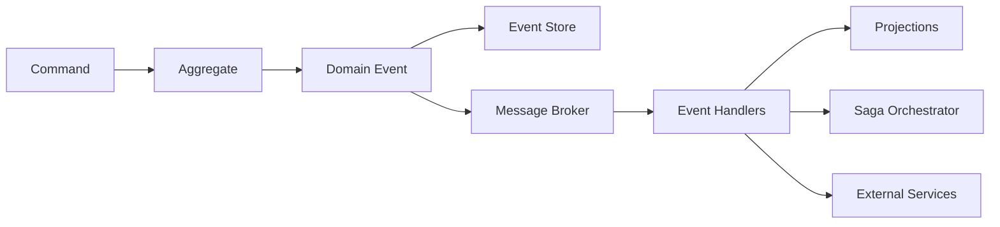

# Domain Events Schema and Versioning
## MTN Admission System Event-Driven Architecture

### Version: 1.0
### Date: 2024-01-15
### Status: Phase 1 - Foundation

---

## 1. Event-Driven Architecture Overview

The MTN Admission System implements an event-driven architecture to enable loose coupling between microservices while maintaining data consistency and business process integrity.

### Core Principles
- **Event Sourcing**: All state changes are captured as immutable events
- **CQRS**: Separate command (write) and query (read) models
- **Saga Pattern**: Orchestrate complex business processes across services
- **Eventual Consistency**: Accept temporary inconsistency for improved scalability

### Event Flow Architecture


---

## 2. Event Categories and Naming Convention

### Event Naming Convention
```
{AggregateType}{EventType}Event
```

**Examples:**
- `ApplicationCreatedEvent`
- `StudentRegisteredEvent`
- `DocumentUploadedEvent`
- `InterviewScheduledEvent`
- `EvaluationCompletedEvent`

### Event Categories

| Category | Description | Examples |
|----------|-------------|-----------|
| **Entity Lifecycle** | Creation, updates, deletion | `UserCreatedEvent`, `ApplicationUpdatedEvent` |
| **State Transitions** | Status changes | `ApplicationSubmittedEvent`, `ApplicationApprovedEvent` |
| **Business Processes** | Workflow events | `InterviewScheduledEvent`, `DocumentValidatedEvent` |
| **Integration Events** | External system interactions | `EmailSentEvent`, `PaymentProcessedEvent` |
| **System Events** | Infrastructure events | `ServiceStartedEvent`, `BackupCompletedEvent` |

---

## 3. Event Schema Definitions

### Base Event Structure
```json
{
  "eventId": "uuid",
  "eventType": "string",
  "aggregateType": "string", 
  "aggregateId": "uuid",
  "eventVersion": "integer",
  "occurredAt": "timestamp",
  "causationId": "uuid",
  "correlationId": "uuid",
  "userId": "uuid",
  "metadata": {
    "source": "string",
    "schemaVersion": "string",
    "contentType": "application/json"
  },
  "data": {}
}
```

### User Domain Events

#### UserCreatedEvent
```json
{
  "eventType": "UserCreatedEvent",
  "aggregateType": "User",
  "aggregateId": "uuid",
  "eventVersion": 1,
  "occurredAt": "2024-01-15T10:30:00Z",
  "data": {
    "email": "jorge.gangale@mtn.cl",
    "role": "ADMIN",
    "educationalLevel": "ALL_LEVELS",
    "subject": "ALL_SUBJECTS",
    "firstName": "Jorge",
    "lastName": "Gangale",
    "active": true,
    "emailVerified": true
  }
}
```

#### UserRoleUpdatedEvent
```json
{
  "eventType": "UserRoleUpdatedEvent", 
  "aggregateType": "User",
  "aggregateId": "uuid",
  "eventVersion": 2,
  "data": {
    "previousRole": "TEACHER",
    "newRole": "COORDINATOR", 
    "previousEducationalLevel": "BASIC",
    "newEducationalLevel": "ALL_LEVELS",
    "updatedBy": "uuid",
    "reason": "Promotion to coordination role"
  }
}
```

#### UserDeactivatedEvent
```json
{
  "eventType": "UserDeactivatedEvent",
  "aggregateType": "User", 
  "aggregateId": "uuid",
  "eventVersion": 3,
  "data": {
    "deactivatedBy": "uuid",
    "reason": "Employee resignation",
    "effectiveDate": "2024-02-01T00:00:00Z",
    "accessRevoked": true
  }
}
```

### Application Domain Events

#### ApplicationCreatedEvent
```json
{
  "eventType": "ApplicationCreatedEvent",
  "aggregateType": "Application",
  "aggregateId": "uuid", 
  "eventVersion": 1,
  "data": {
    "applicantUserId": "uuid",
    "studentData": {
      "firstName": "María Elena",
      "lastName": "González López", 
      "rut": "20123456-7",
      "birthDate": "2015-03-15",
      "grade": "KINDER",
      "targetSchool": "MONTE_TABOR",
      "hasSpecialNeeds": false,
      "previousSchool": "Jardín Los Pequeños"
    },
    "parentData": {
      "father": {
        "firstName": "Carlos",
        "lastName": "González",
        "rut": "12345678-9", 
        "email": "carlos@test.com",
        "phone": "+56912345678",
        "occupation": "Ingeniero"
      },
      "mother": {
        "firstName": "Elena",
        "lastName": "López", 
        "rut": "98765432-1",
        "email": "elena@test.com", 
        "phone": "+56987654321",
        "occupation": "Profesora"
      }
    },
    "guardianData": {
      "firstName": "Elena",
      "lastName": "López",
      "relationship": "MOTHER",
      "address": "Av. Providencia 1234, Santiago",
      "isPrimaryContact": true
    },
    "supporterData": {
      "firstName": "Carlos", 
      "lastName": "González",
      "relationship": "FATHER",
      "monthlyIncome": 2500000,
      "employmentStatus": "FULL_TIME"
    },
    "submissionDate": "2024-01-15T14:30:00Z",
    "comments": "Familia interesada en educación bilingüe"
  }
}
```

#### ApplicationStatusChangedEvent
```json
{
  "eventType": "ApplicationStatusChangedEvent",
  "aggregateType": "Application",
  "aggregateId": "uuid",
  "eventVersion": 2, 
  "data": {
    "previousStatus": "PENDING",
    "newStatus": "UNDER_REVIEW", 
    "changedBy": "uuid",
    "changeReason": "All required documents submitted",
    "automaticTransition": false,
    "reviewerNotes": "Complete application ready for evaluation"
  }
}
```

#### ApplicationSubmittedEvent
```json
{
  "eventType": "ApplicationSubmittedEvent",
  "aggregateType": "Application", 
  "aggregateId": "uuid",
  "eventVersion": 3,
  "data": {
    "submittedBy": "uuid",
    "submissionDate": "2024-01-15T16:45:00Z",
    "requiredDocumentsCount": 5,
    "submittedDocumentsCount": 5,
    "allDocumentsValid": true,
    "nextSteps": ["DOCUMENT_VALIDATION", "ACADEMIC_EVALUATION"],
    "estimatedProcessingDays": 14
  }
}
```

### Document Domain Events

#### DocumentUploadedEvent
```json
{
  "eventType": "DocumentUploadedEvent",
  "aggregateType": "Document",
  "aggregateId": "uuid",
  "eventVersion": 1,
  "data": {
    "applicationId": "uuid",
    "documentType": "BIRTH_CERTIFICATE",
    "fileName": "certificado_nacimiento_maria.pdf",
    "filePath": "/uploads/applications/123/birth_certificate.pdf",
    "fileSize": 245760,
    "mimeType": "application/pdf", 
    "uploadedBy": "uuid",
    "checksumSHA256": "a1b2c3d4e5f6...",
    "virusScanResult": "CLEAN",
    "documentValidation": {
      "isValid": true,
      "validationMessages": [],
      "expirationDate": null
    }
  }
}
```

#### DocumentValidatedEvent
```json
{
  "eventType": "DocumentValidatedEvent",
  "aggregateType": "Document",
  "aggregateId": "uuid", 
  "eventVersion": 2,
  "data": {
    "validatedBy": "uuid",
    "validationDate": "2024-01-15T17:30:00Z",
    "isValid": true,
    "validationCriteria": [
      {
        "criterion": "DOCUMENT_TYPE_MATCH",
        "passed": true,
        "notes": "Birth certificate format correct"
      },
      {
        "criterion": "DOCUMENT_READABILITY", 
        "passed": true,
        "notes": "All text clearly legible"
      },
      {
        "criterion": "REQUIRED_INFORMATION",
        "passed": true,
        "notes": "Contains all required fields"
      }
    ],
    "rejectionReasons": [],
    "requiresResubmission": false
  }
}
```

### Evaluation Domain Events

#### EvaluationScheduledEvent
```json
{
  "eventType": "EvaluationScheduledEvent",
  "aggregateType": "Evaluation",
  "aggregateId": "uuid",
  "eventVersion": 1,
  "data": {
    "applicationId": "uuid", 
    "evaluationType": "ACADEMIC",
    "evaluatorId": "uuid",
    "scheduledDate": "2024-01-20T10:00:00Z",
    "duration": 120,
    "location": "Aula 301, Monte Tabor",
    "subject": "MATHEMATICS",
    "educationalLevel": "BASIC",
    "specialInstructions": "Traer calculadora científica",
    "scheduledBy": "uuid",
    "notificationsSent": ["EMAIL", "SMS"]
  }
}
```

#### EvaluationCompletedEvent
```json
{
  "eventType": "EvaluationCompletedEvent",
  "aggregateType": "Evaluation",
  "aggregateId": "uuid",
  "eventVersion": 2,
  "data": {
    "completedDate": "2024-01-20T12:00:00Z",
    "evaluatorId": "uuid",
    "scores": {
      "overallScore": 85,
      "maxScore": 100,
      "breakdown": {
        "algebra": 90,
        "geometry": 80,
        "problemSolving": 85
      }
    },
    "recommendation": "APPROVED",
    "evaluatorNotes": "Strong mathematical reasoning, needs improvement in geometry",
    "nextEvaluationRequired": "PSYCHOLOGICAL",
    "processingComplete": false
  }
}
```

### Interview Domain Events

#### InterviewScheduledEvent
```json
{
  "eventType": "InterviewScheduledEvent",
  "aggregateType": "Interview",
  "aggregateId": "uuid",
  "eventVersion": 1,
  "data": {
    "applicationId": "uuid",
    "interviewType": "DIRECTOR_INTERVIEW",
    "interviewerId": "uuid",
    "scheduledDate": "2024-01-25T15:30:00Z",
    "duration": 60,
    "location": "Oficina Dirección, Monte Tabor",
    "participants": [
      {
        "participantId": "uuid",
        "relationship": "STUDENT",
        "required": true
      },
      {
        "participantId": "uuid", 
        "relationship": "MOTHER",
        "required": true
      },
      {
        "participantId": "uuid",
        "relationship": "FATHER", 
        "required": false
      }
    ],
    "preparationMaterials": [
      "student_portfolio.pdf",
      "previous_school_report.pdf"
    ],
    "scheduledBy": "uuid",
    "confirmationRequired": true
  }
}
```

#### InterviewCompletedEvent
```json
{
  "eventType": "InterviewCompletedEvent",
  "aggregateType": "Interview",
  "aggregateId": "uuid",
  "eventVersion": 2,
  "data": {
    "completedDate": "2024-01-25T16:30:00Z",
    "actualDuration": 65,
    "attendees": [
      {
        "participantId": "uuid",
        "attended": true,
        "punctual": true
      }
    ],
    "evaluation": {
      "studentMotivation": 9,
      "academicReadiness": 8,
      "familySupport": 10,
      "schoolFit": 9,
      "overallScore": 9
    },
    "decision": "APPROVED",
    "interviewerNotes": "Excellent family values alignment, student shows strong motivation",
    "recommendedAction": "PROCEED_TO_ADMISSION",
    "followUpRequired": false
  }
}
```

### Notification Domain Events

#### EmailNotificationSentEvent
```json
{
  "eventType": "EmailNotificationSentEvent",
  "aggregateType": "EmailNotification",
  "aggregateId": "uuid", 
  "eventVersion": 1,
  "data": {
    "recipientId": "uuid",
    "recipientEmail": "familia@test.com",
    "templateId": "INTERVIEW_SCHEDULED",
    "subject": "Entrevista Programada - Sistema de Admisión MTN",
    "sentAt": "2024-01-15T18:00:00Z",
    "deliveryStatus": "DELIVERED",
    "openedAt": "2024-01-15T18:05:00Z",
    "clickedAt": null,
    "bounced": false,
    "personalizedData": {
      "studentName": "María Elena González",
      "interviewDate": "2024-01-25T15:30:00Z",
      "location": "Oficina Dirección, Monte Tabor",
      "confirmationUrl": "https://admision.mtn.cl/confirm/uuid"
    },
    "trackingId": "uuid"
  }
}
```

---

## 4. Event Schema Versioning Strategy

### Versioning Principles
1. **Backward Compatibility**: New versions must not break existing consumers
2. **Additive Changes**: Only add new fields, never remove or rename
3. **Schema Evolution**: Use semantic versioning for event schemas
4. **Migration Strategy**: Support multiple schema versions simultaneously

### Schema Version Management
```json
{
  "schemaRegistry": {
    "baseUrl": "http://schema-registry:8081",
    "schemas": {
      "ApplicationCreatedEvent": {
        "v1": {
          "schemaId": 1001,
          "compatibility": "BACKWARD",
          "deprecated": false,
          "supportedUntil": null
        },
        "v2": {
          "schemaId": 1002, 
          "compatibility": "BACKWARD",
          "deprecated": false,
          "supportedUntil": null,
          "changes": [
            "Added specialNeeds field to studentData",
            "Added emergencyContact to guardianData"
          ]
        }
      }
    }
  }
}
```

### Event Schema Evolution Example
```json
// ApplicationCreatedEvent v1
{
  "eventType": "ApplicationCreatedEvent",
  "schemaVersion": "1.0",
  "data": {
    "studentData": {
      "firstName": "string",
      "lastName": "string",
      "rut": "string",
      "birthDate": "date"
    }
  }
}

// ApplicationCreatedEvent v2 (backward compatible)
{
  "eventType": "ApplicationCreatedEvent", 
  "schemaVersion": "2.0",
  "data": {
    "studentData": {
      "firstName": "string",
      "lastName": "string", 
      "rut": "string",
      "birthDate": "date",
      "specialNeeds": "boolean?",  // Optional field
      "allergies": "string[]?"     // Optional field
    },
    "emergencyContact": {          // New optional section
      "name": "string?",
      "phone": "string?", 
      "relationship": "string?"
    }
  }
}
```

### Consumer Version Compatibility
```java
@EventHandler
public void handle(ApplicationCreatedEvent event) {
    // Handle both v1 and v2 events
    var studentData = event.getData().getStudentData();
    
    // v1 fields (always present)
    processBasicStudentInfo(studentData);
    
    // v2 fields (optional)
    if (studentData.getSpecialNeeds() != null) {
        processSpecialNeeds(studentData.getSpecialNeeds());
    }
    
    if (event.getData().getEmergencyContact() != null) {
        processEmergencyContact(event.getData().getEmergencyContact());
    }
}
```

---

## 5. Event Store Implementation

### Event Store Schema
```sql
CREATE TABLE domain_events (
    event_id UUID PRIMARY KEY DEFAULT gen_random_uuid(),
    event_type VARCHAR(100) NOT NULL,
    aggregate_type VARCHAR(50) NOT NULL,
    aggregate_id UUID NOT NULL,
    event_version INTEGER NOT NULL,
    schema_version VARCHAR(10) NOT NULL DEFAULT '1.0',
    event_data JSONB NOT NULL,
    metadata JSONB,
    occurred_at TIMESTAMP DEFAULT NOW(),
    causation_id UUID,
    correlation_id UUID,
    user_id UUID,
    
    -- Performance indexes
    UNIQUE(aggregate_id, event_version),
    INDEX idx_aggregate_type_id (aggregate_type, aggregate_id),
    INDEX idx_event_type (event_type),
    INDEX idx_occurred_at (occurred_at),
    INDEX idx_correlation_id (correlation_id)
);

-- Event snapshots for performance
CREATE TABLE aggregate_snapshots (
    aggregate_id UUID PRIMARY KEY,
    aggregate_type VARCHAR(50) NOT NULL,
    snapshot_version INTEGER NOT NULL,
    snapshot_data JSONB NOT NULL,
    created_at TIMESTAMP DEFAULT NOW()
);
```

### Event Store Operations
```java
@Repository
public class EventStore {
    
    public void saveEvent(DomainEvent event) {
        var eventData = EventData.builder()
            .eventId(event.getEventId())
            .eventType(event.getClass().getSimpleName())
            .aggregateType(event.getAggregateType())
            .aggregateId(event.getAggregateId())
            .eventVersion(event.getEventVersion())
            .schemaVersion(event.getSchemaVersion())
            .eventData(jsonMapper.toJson(event))
            .occurredAt(event.getOccurredAt())
            .build();
            
        jdbcTemplate.execute(INSERT_EVENT_SQL, eventData);
        
        // Publish to message broker
        messagePublisher.publish(event);
    }
    
    public List<DomainEvent> getEvents(UUID aggregateId) {
        return jdbcTemplate.query(
            SELECT_EVENTS_SQL, 
            new Object[]{aggregateId},
            this::mapToEvent
        );
    }
    
    public List<DomainEvent> getEvents(UUID aggregateId, int fromVersion) {
        return jdbcTemplate.query(
            SELECT_EVENTS_FROM_VERSION_SQL,
            new Object[]{aggregateId, fromVersion}, 
            this::mapToEvent
        );
    }
}
```

---

## 6. Message Broker Configuration

### RabbitMQ Exchange and Queue Setup
```yaml
# exchanges configuration
exchanges:
  - name: mtn.domain.events
    type: topic
    durable: true
    auto_delete: false
    
  - name: mtn.saga.commands
    type: direct
    durable: true
    auto_delete: false

# Queue bindings
queues:
  # User Service Events
  - name: user.service.events
    exchange: mtn.domain.events
    routing_keys: 
      - "user.*"
      - "authentication.*"
    
  # Application Service Events  
  - name: application.service.events
    exchange: mtn.domain.events
    routing_keys:
      - "application.*"
      - "workflow.*"
      
  # Document Service Events
  - name: document.service.events
    exchange: mtn.domain.events
    routing_keys:
      - "document.*"
      - "file.*"
      
  # Notification Service Events
  - name: notification.service.events  
    exchange: mtn.domain.events
    routing_keys:
      - "notification.*"
      - "email.*"
      - "sms.*"
      
  # Evaluation Service Events
  - name: evaluation.service.events
    exchange: mtn.domain.events
    routing_keys:
      - "evaluation.*"
      - "academic.*"
      - "psychological.*"
      
  # Interview Service Events  
  - name: interview.service.events
    exchange: mtn.domain.events
    routing_keys:
      - "interview.*"
      - "schedule.*"

# Dead letter queues for error handling
dead_letter_queues:
  - name: mtn.domain.events.dlq
    message_ttl: 3600000  # 1 hour
    max_retries: 3
```

### Event Routing Strategy
```java
@Component
public class EventRouter {
    
    private final Map<String, String> eventRoutingMap = Map.of(
        "UserCreatedEvent", "user.created",
        "UserUpdatedEvent", "user.updated", 
        "UserDeactivatedEvent", "user.deactivated",
        "ApplicationCreatedEvent", "application.created",
        "ApplicationStatusChangedEvent", "application.status.changed",
        "DocumentUploadedEvent", "document.uploaded",
        "EvaluationCompletedEvent", "evaluation.completed",
        "InterviewScheduledEvent", "interview.scheduled"
    );
    
    public String getRoutingKey(DomainEvent event) {
        return eventRoutingMap.getOrDefault(
            event.getClass().getSimpleName(),
            "unknown.event"
        );
    }
}
```

---

## 7. Event-Driven Saga Implementation

### Application Approval Saga
```java
@Saga
@Component
public class ApplicationApprovalSaga {
    
    private static final String SAGA_TYPE = "ApplicationApprovalSaga";
    
    @Autowired
    private CommandGateway commandGateway;
    
    @Autowired
    private SagaRepository sagaRepository;
    
    // Saga state
    @SagaProperty
    private UUID applicationId;
    
    @SagaProperty
    private String currentStep;
    
    @SagaProperty  
    private Map<String, Object> sagaData;
    
    @StartSaga
    @SagaOrchestrationStart
    public void handle(ApplicationSubmittedEvent event) {
        this.applicationId = event.getAggregateId();
        this.currentStep = "DOCUMENT_VALIDATION";
        this.sagaData = new HashMap<>();
        
        log.info("Starting application approval saga for application: {}", applicationId);
        
        // Step 1: Validate all required documents
        commandGateway.send(new ValidateDocumentsCommand(
            applicationId,
            event.getData().getRequiredDocuments()
        ));
    }
    
    @SagaOrchestrationNext
    public void handle(DocumentsValidatedEvent event) {
        if (event.getData().isAllDocumentsValid()) {
            this.currentStep = "ACADEMIC_EVALUATION";
            sagaData.put("documentsValid", true);
            
            // Step 2: Schedule academic evaluation
            commandGateway.send(new ScheduleAcademicEvaluationCommand(
                applicationId,
                event.getData().getStudentGrade()
            ));
        } else {
            // Request missing or invalid documents
            this.currentStep = "DOCUMENTS_REQUESTED";
            commandGateway.send(new RequestDocumentsCommand(
                applicationId,
                event.getData().getMissingDocuments(),
                event.getData().getInvalidDocuments()
            ));
        }
    }
    
    @SagaOrchestrationNext
    public void handle(AcademicEvaluationCompletedEvent event) {
        var score = event.getData().getOverallScore();
        sagaData.put("academicScore", score);
        
        if (score >= getMinimumAcademicScore()) {
            this.currentStep = "PSYCHOLOGICAL_EVALUATION"; 
            
            // Step 3: Schedule psychological evaluation
            commandGateway.send(new SchedulePsychologicalEvaluationCommand(
                applicationId
            ));
        } else {
            // Academic score too low - reject application
            this.currentStep = "REJECTED";
            commandGateway.send(new RejectApplicationCommand(
                applicationId,
                "Academic evaluation score below minimum threshold: " + score
            ));
        }
    }
    
    @SagaOrchestrationNext
    public void handle(PsychologicalEvaluationCompletedEvent event) {
        var recommendation = event.getData().getRecommendation();
        sagaData.put("psychologicalRecommendation", recommendation);
        
        if ("APPROVED".equals(recommendation)) {
            this.currentStep = "DIRECTOR_INTERVIEW";
            
            // Step 4: Schedule director interview
            commandGateway.send(new ScheduleDirectorInterviewCommand(
                applicationId
            ));
        } else if ("APPROVED_WITH_CONDITIONS".equals(recommendation)) {
            this.currentStep = "DIRECTOR_INTERVIEW_REQUIRED";
            
            // Require director interview for conditional approval
            commandGateway.send(new ScheduleDirectorInterviewCommand(
                applicationId,
                event.getData().getConditions()
            ));
        } else {
            // Psychological evaluation not recommended
            this.currentStep = "REJECTED";
            commandGateway.send(new RejectApplicationCommand(
                applicationId,
                "Psychological evaluation not recommended: " + 
                event.getData().getNotes()
            ));
        }
    }
    
    @SagaOrchestrationNext
    public void handle(DirectorInterviewCompletedEvent event) {
        var decision = event.getData().getDecision();
        sagaData.put("directorDecision", decision);
        
        switch (decision) {
            case "APPROVED":
                this.currentStep = "APPROVED";
                commandGateway.send(new ApproveApplicationCommand(applicationId));
                break;
                
            case "WAITLIST":
                this.currentStep = "WAITLISTED";
                commandGateway.send(new WaitlistApplicationCommand(
                    applicationId,
                    event.getData().getWaitlistReason()
                ));
                break;
                
            case "REJECTED":
                this.currentStep = "REJECTED"; 
                commandGateway.send(new RejectApplicationCommand(
                    applicationId,
                    event.getData().getRejectionReason()
                ));
                break;
        }
    }
    
    @EndSaga
    @SagaOrchestrationNext
    public void handle(ApplicationFinalStatusEvent event) {
        log.info("Application approval saga completed for application: {} with status: {}", 
            applicationId, event.getData().getFinalStatus());
            
        // Send final notification to family
        commandGateway.send(new SendFinalDecisionNotificationCommand(
            applicationId,
            event.getData().getFinalStatus(),
            sagaData
        ));
    }
    
    // Compensation handlers for saga rollback
    @SagaOrchestrationCompensation
    public void compensate(DocumentValidationFailedEvent event) {
        log.warn("Compensating document validation for application: {}", applicationId);
        // Cancel any scheduled evaluations
        commandGateway.send(new CancelScheduledEvaluationsCommand(applicationId));
    }
    
    @SagaOrchestrationCompensation  
    public void compensate(EvaluationFailedEvent event) {
        log.warn("Compensating evaluation failure for application: {}", applicationId);
        // Reset application status
        commandGateway.send(new ResetApplicationStatusCommand(applicationId, "UNDER_REVIEW"));
    }
    
    private int getMinimumAcademicScore() {
        return 70; // Configurable minimum score
    }
}
```

---

## 8. Event Monitoring and Observability

### Event Metrics Collection
```java
@Component
public class EventMetricsCollector {
    
    private final MeterRegistry meterRegistry;
    private final Counter eventPublishedCounter;
    private final Counter eventProcessedCounter; 
    private final Timer eventProcessingTimer;
    
    public EventMetricsCollector(MeterRegistry meterRegistry) {
        this.meterRegistry = meterRegistry;
        this.eventPublishedCounter = Counter.builder("events.published")
            .description("Number of events published")
            .register(meterRegistry);
        this.eventProcessedCounter = Counter.builder("events.processed")
            .description("Number of events processed")
            .register(meterRegistry);
        this.eventProcessingTimer = Timer.builder("events.processing.duration")
            .description("Event processing duration")
            .register(meterRegistry);
    }
    
    @EventListener
    public void onEventPublished(EventPublishedEvent event) {
        eventPublishedCounter.increment(
            Tags.of(
                "eventType", event.getEventType(),
                "aggregateType", event.getAggregateType()
            )
        );
    }
    
    @EventListener
    public void onEventProcessed(EventProcessedEvent event) {
        eventProcessedCounter.increment(
            Tags.of(
                "eventType", event.getEventType(),
                "handler", event.getHandlerClass(),
                "success", String.valueOf(event.isSuccessful())
            )
        );
        
        eventProcessingTimer.record(
            event.getProcessingDuration(),
            TimeUnit.MILLISECONDS
        );
    }
}
```

### Event Tracing Integration
```java
@Component
public class TracedEventPublisher {
    
    @Autowired
    private Tracer tracer;
    
    @Autowired
    private MessagePublisher messagePublisher;
    
    public void publish(DomainEvent event) {
        var span = tracer.nextSpan()
            .name("event.publish")
            .tag("event.type", event.getClass().getSimpleName())
            .tag("aggregate.type", event.getAggregateType())
            .tag("aggregate.id", event.getAggregateId().toString())
            .start();
            
        try (var ws = tracer.withSpanInScope(span)) {
            // Add trace context to event metadata
            event.getMetadata().put("traceId", span.context().traceId());
            event.getMetadata().put("spanId", span.context().spanId());
            
            messagePublisher.publish(event);
            
            span.tag("publish.success", "true");
        } catch (Exception e) {
            span.tag("publish.success", "false");
            span.tag("error", e.getMessage());
            throw e;
        } finally {
            span.end();
        }
    }
}
```

## Conclusion

This domain events specification provides a comprehensive foundation for the MTN Admission System's event-driven architecture. The schema definitions, versioning strategy, and saga implementations ensure:

- **Data Consistency**: Through event sourcing and saga patterns
- **System Integration**: Via well-defined event contracts  
- **Observability**: With comprehensive tracing and metrics
- **Evolution**: Through backward-compatible schema versioning
- **Reliability**: With dead letter queues and compensation handlers

The events defined here will enable the system to maintain business process integrity while allowing independent service development and deployment.