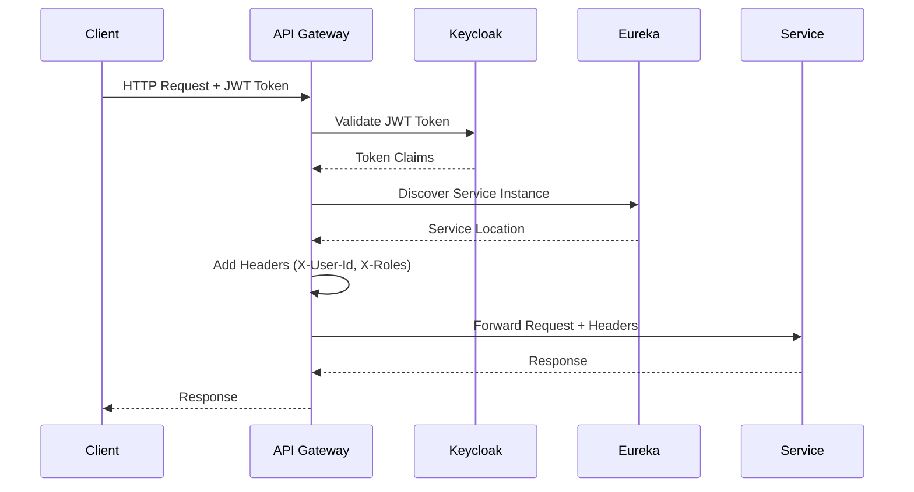

# API Gateway - Spring Cloud Gateway
## MTN Admission System Request Router and Authentication Proxy

[](https://spring.io/projects/spring-cloud-gateway)
[](#jwt-validation)
[](#service-discovery-integration)

---

## 📋 Overview

The API Gateway serves as the single entry point for the MTN Admission System, providing:

- **Request Routing**: Intelligent routing to backend services
- **JWT Authentication**: Token validation and user context propagation  
- **Service Discovery**: Dynamic service registration and health checking
- **Load Balancing**: Automatic load balancing across service instances
- **Observability**: Request tracing and metrics collection

---

## 🏗️ Architecture

### Gateway Flow Diagram


### Key Components
- **Gateway Routes**: Path-based routing configuration
- **JWT Filter**: Token validation and claim extraction
- **Header Propagation**: User context forwarding
- **Circuit Breaker**: Resilience patterns
- **Rate Limiting**: Request throttling
- **Observability**: Tracing and metrics

---

## 🚀 Quick Start

### Prerequisites
- Java 17+
- Maven 3.8+
- Docker (for containerized deployment)
- Running Eureka Server
- Running Keycloak instance

### Local Development
```bash
# Navigate to API Gateway
cd platform/api-gateway

# Run locally
mvn spring-boot:run

# With custom profile
mvn spring-boot:run -Dspring.profiles.active=local

# Build JAR
mvn clean package

# Run built JAR
java -jar target/api-gateway-1.0.0.jar
```

### Docker Deployment
```bash
# Build Docker image
docker build -t mtn-api-gateway .

# Run with Docker Compose
docker-compose up -d api-gateway

# Check health
curl http://localhost:8080/actuator/health
```

---

## ⚙️ Configuration

### Application Configuration (`application.yml`)
```yaml
server:
  port: 8080

spring:
  application:
    name: api-gateway
    
  # Service Discovery
  cloud:
    gateway:
      discovery:
        locator:
          enabled: true
          lower-case-service-id: true
          
      # Route Configuration
      routes:
        # Monolith API Routes (Phase 1)
        - id: monolith-api
          uri: lb://admision-monolith
          predicates:
            - Path=/api/**
          filters:
            - name: JwtAuthentication
            - name: HeaderPropagation
            - name: CircuitBreaker
              args:
                name: monolith-breaker
                fallbackUri: forward:/fallback
                
        # Frontend Routes
        - id: frontend
          uri: lb://frontend
          predicates:
            - Path=/**
          filters:
            - name: RewritePath
              args:
                regexp: /(.*)
                replacement: /$1

  # JWT Configuration
  security:
    oauth2:
      resourceserver:
        jwt:
          issuer-uri: ${KEYCLOAK_ISSUER_URI:http://keycloak:8080/realms/mtn-admision}
          jwk-set-uri: ${KEYCLOAK_JWK_SET_URI:http://keycloak:8080/realms/mtn-admision/protocol/openid-connect/certs}

# Eureka Client Configuration          
eureka:
  client:
    service-url:
      defaultZone: ${EUREKA_SERVER_URL:http://eureka-server:8761/eureka/}
    register-with-eureka: true
    fetch-registry: true
  instance:
    prefer-ip-address: true
    hostname: ${HOSTNAME:api-gateway}
    
# Management and Observability
management:
  endpoints:
    web:
      exposure:
        include: "*"
  endpoint:
    health:
      show-details: always
  tracing:
    sampling:
      probability: 1.0
```

### Environment Variables
```bash
# Keycloak Configuration
KEYCLOAK_ISSUER_URI=http://keycloak:8080/realms/mtn-admision
KEYCLOAK_JWK_SET_URI=http://keycloak:8080/realms/mtn-admision/protocol/openid-connect/certs

# Eureka Configuration  
EUREKA_SERVER_URL=http://eureka-server:8761/eureka/

# Observability
OTEL_EXPORTER_OTLP_ENDPOINT=http://otel-collector:4317
OTEL_SERVICE_NAME=api-gateway
OTEL_RESOURCE_ATTRIBUTES=service.name=api-gateway,service.version=1.0.0
```

---

## 🔐 JWT Authentication

### JWT Token Validation Flow
1. **Extract Token**: Get JWT from `Authorization: Bearer <token>` header
2. **Validate Signature**: Verify token against Keycloak's JWK Set
3. **Extract Claims**: Get user information from token payload
4. **Propagate Context**: Add user headers to downstream requests

### Custom JWT Filter
```java
@Component
public class JwtAuthenticationFilter implements GatewayFilter {
    
    @Override
    public Mono<Void> filter(ServerWebExchange exchange, GatewayFilterChain chain) {
        return extractJwtToken(exchange.getRequest())
            .flatMap(this::validateToken)
            .flatMap(jwt -> addUserHeaders(exchange, jwt))
            .then(chain.filter(exchange))
            .onErrorResume(this::handleAuthError);
    }
    
    private Mono<ServerWebExchange> addUserHeaders(ServerWebExchange exchange, Jwt jwt) {
        var request = exchange.getRequest().mutate()
            .header("X-User-Id", jwt.getClaimAsString("sub"))
            .header("X-User-Email", jwt.getClaimAsString("email"))
            .header("X-Roles", String.join(",", jwt.getClaimAsStringList("roles")))
            .header("X-Educational-Level", jwt.getClaimAsString("educational_level"))
            .header("X-Subject", jwt.getClaimAsString("subject"))
            .build();
            
        return Mono.just(exchange.mutate().request(request).build());
    }
}
```

### Header Propagation
The gateway automatically adds these headers to all downstream requests:

| Header | Description | Example |
|--------|-------------|---------|
| `X-User-Id` | User's unique identifier | `uuid` |
| `X-User-Email` | User's email address | `jorge.gangale@mtn.cl` |
| `X-Roles` | Comma-separated user roles | `ADMIN,TEACHER` |
| `X-Educational-Level` | User's educational level | `ALL_LEVELS` |
| `X-Subject` | User's subject specialty | `MATHEMATICS` |
| `X-Trace-Id` | Distributed tracing ID | `a1b2c3d4-e5f6-...` |

---

## 🌐 Routing Configuration

### Dynamic Service Discovery Routes
```yaml
# Automatic route generation from Eureka registry
spring:
  cloud:
    gateway:
      discovery:
        locator:
          enabled: true
          # Generate routes like: /service-name/** -> lb://service-name
```

### Manual Route Configuration
```yaml
routes:
  # Phase 1: Monolith Routes
  - id: monolith-applications
    uri: lb://admision-monolith
    predicates:
      - Path=/api/applications/**
    filters:
      - name: JwtAuthentication
      - name: HeaderPropagation
      - name: RequestRateLimiter
        args:
          redis-rate-limiter.replenishRate: 100
          redis-rate-limiter.burstCapacity: 200
          
  # Phase 2+: Microservice Routes
  - id: user-service
    uri: lb://user-service
    predicates:
      - Path=/api/users/**
    filters:
      - name: JwtAuthentication
      - name: HeaderPropagation
      - name: CircuitBreaker
        args:
          name: user-service-breaker
          
  - id: notification-service
    uri: lb://notification-service
    predicates:
      - Path=/api/notifications/**
    filters:
      - name: JwtAuthentication
```

### Route Predicates and Filters

#### Built-in Predicates
- `Path`: Route by URL path
- `Method`: Route by HTTP method
- `Header`: Route by request headers
- `Query`: Route by query parameters
- `Host`: Route by hostname

#### Custom Filters
- `JwtAuthentication`: JWT token validation
- `HeaderPropagation`: User context headers
- `RateLimiting`: Request throttling  
- `CircuitBreaker`: Resilience patterns
- `RequestLogging`: Request/response logging

---

## 🔄 Circuit Breaker and Resilience

### Circuit Breaker Configuration
```yaml
resilience4j:
  circuitbreaker:
    instances:
      monolith-breaker:
        sliding-window-size: 10
        minimum-number-of-calls: 5
        failure-rate-threshold: 50
        wait-duration-in-open-state: 30s
        permitted-number-of-calls-in-half-open-state: 3
        
  timelimiter:
    instances:
      monolith-breaker:
        timeout-duration: 10s
```

### Fallback Handling
```java
@RestController
public class FallbackController {
    
    @RequestMapping("/fallback")
    public ResponseEntity<Map<String, Object>> fallback(ServerHttpRequest request) {
        return ResponseEntity.status(503)
            .body(Map.of(
                "error", "Service Temporarily Unavailable",
                "message", "The requested service is currently unavailable. Please try again later.",
                "timestamp", Instant.now(),
                "path", request.getPath().value()
            ));
    }
}
```

---

## 📊 Observability and Monitoring

### Health Check Endpoint
```bash
# Gateway health
curl http://localhost:8080/actuator/health

# Response example
{
  "status": "UP",
  "components": {
    "discoveryComposite": {
      "status": "UP",
      "components": {
        "eureka": {"status": "UP"}
      }
    },
    "gateway": {
      "status": "UP"
    },
    "ping": {
      "status": "UP"
    }
  }
}
```

### Metrics Collection
```bash
# Gateway-specific metrics
curl http://localhost:8080/actuator/metrics

# Key metrics:
# - gateway.requests (request count by route)
# - http.server.requests (response times)
# - jvm.memory.used (memory usage)
# - resilience4j.circuitbreaker.state (circuit breaker status)
```

### Distributed Tracing
```yaml
# OpenTelemetry configuration
management:
  tracing:
    sampling:
      probability: 1.0
  otlp:
    tracing:
      endpoint: http://otel-collector:4317
```

### Log Configuration
```xml
<!-- logback-spring.xml -->
<configuration>
    <appender name="STDOUT" class="ch.qos.logback.core.ConsoleAppender">
        <encoder class="net.logstash.logback.encoder.LogstashEncoder">
            <includeContext>true</includeContext>
            <includeMdc>true</includeMdc>
            <fieldNames>
                <timestamp>@timestamp</timestamp>
                <level>level</level>
                <message>message</message>
            </fieldNames>
        </encoder>
    </appender>
    
    <root level="INFO">
        <appender-ref ref="STDOUT" />
    </root>
    
    <!-- Gateway-specific loggers -->
    <logger name="org.springframework.cloud.gateway" level="DEBUG" />
    <logger name="com.desafios.mtn.gateway" level="INFO" />
</configuration>
```

---

## 🛠️ Development and Testing

### Unit Testing
```java
@SpringBootTest
@TestPropertySource(properties = {
    "spring.cloud.discovery.enabled=false"
})
class ApiGatewayApplicationTests {
    
    @Test
    void contextLoads() {
        // Gateway context loads successfully
    }
    
    @Test
    void jwtFilterWorks() {
        // JWT validation filter tests
    }
    
    @Test  
    void headerPropagationWorks() {
        // Header propagation tests
    }
}
```

### Integration Testing
```bash
# Start test environment
docker-compose -f docker-compose.test.yml up -d

# Run integration tests
mvn test -Dtest=**/*IntegrationTest

# Test specific routes
curl -H "Authorization: Bearer <jwt-token>" \
     http://localhost:8080/api/applications

# Test service discovery
curl http://localhost:8080/actuator/gateway/routes
```

### Load Testing
```bash
# Using Apache Bench
ab -n 1000 -c 10 -H "Authorization: Bearer <token>" \
   http://localhost:8080/api/applications

# Using JMeter
jmeter -n -t gateway-load-test.jmx -l results.jtl
```

---

## 🚨 Troubleshooting

### Common Issues

#### Service Discovery Problems
```bash
# Check Eureka registration
curl http://eureka-server:8761/eureka/apps

# Check gateway routes
curl http://localhost:8080/actuator/gateway/routes

# Verify service health
curl http://localhost:8080/actuator/health/discoveryComposite
```

#### JWT Authentication Issues
```bash
# Validate JWT token manually
curl -H "Authorization: Bearer <token>" \
     http://keycloak:8080/realms/mtn-admision/protocol/openid-connect/userinfo

# Check JWK Set availability
curl http://keycloak:8080/realms/mtn-admision/protocol/openid-connect/certs
```

#### Circuit Breaker Debugging
```bash
# Check circuit breaker status
curl http://localhost:8080/actuator/metrics/resilience4j.circuitbreaker.state

# View circuit breaker events
curl http://localhost:8080/actuator/circuitbreakerevents
```

### Log Analysis
```bash
# Filter gateway logs
docker logs api-gateway 2>&1 | grep "ERROR\|WARN"

# Follow specific route logs
docker logs -f api-gateway | grep "route_id=monolith-api"

# Check authentication logs
docker logs api-gateway | grep "JwtAuthentication"
```

### Performance Tuning
```yaml
# JVM tuning for gateway
JAVA_OPTS: >-
  -Xmx1g -Xms512m
  -XX:+UseG1GC
  -XX:MaxGCPauseMillis=200
  -Dspring.main.lazy-initialization=true

# Connection pool tuning
spring:
  cloud:
    gateway:
      httpclient:
        pool:
          max-connections: 1000
          max-idle-time: 30s
        connect-timeout: 3000
        response-timeout: 30s
```

---

## 🔄 Migration Strategy

### Phase 1: Monolith Proxy (Current)
- ✅ All routes forward to monolith
- ✅ JWT validation at gateway
- ✅ User context propagation
- ✅ Observability integration

### Phase 2: First Service Migration
```yaml
# Add new service routes
routes:
  - id: user-service-beta
    uri: lb://user-service
    predicates:
      - Path=/api/users/**
      - Header=X-Beta-Feature, true
    filters:
      - name: HeaderPropagation
      - name: CircuitBreaker
        args:
          name: user-service
          fallbackUri: lb://admision-monolith
```

### Phase 3: Gradual Migration
```yaml
# Traffic splitting configuration
routes:
  - id: user-service-canary
    uri: lb://user-service
    predicates:
      - Path=/api/users/**
      - Weight=group1, 20  # 20% traffic to new service
      
  - id: user-service-legacy  
    uri: lb://admision-monolith
    predicates:
      - Path=/api/users/**
      - Weight=group1, 80  # 80% traffic to monolith
```

---

## 📚 Additional Resources

### Documentation
- [Spring Cloud Gateway Documentation](https://spring.io/projects/spring-cloud-gateway)
- [JWT Authentication Guide](../docs/authentication.md)
- [Service Discovery Setup](../eureka-server/README.md)
- [Observability Integration](../docs/observability.md)

### Monitoring URLs
- **Gateway Routes**: http://localhost:8080/actuator/gateway/routes
- **Health Check**: http://localhost:8080/actuator/health  
- **Metrics**: http://localhost:8080/actuator/metrics
- **Circuit Breakers**: http://localhost:8080/actuator/circuitbreakerevents

### Configuration Files
- [`application.yml`](./src/main/resources/application.yml) - Main configuration
- [`pom.xml`](./pom.xml) - Maven dependencies
- [`Dockerfile`](./Dockerfile) - Container configuration
- [`logback-spring.xml`](./src/main/resources/logback-spring.xml) - Logging setup

---

**🚪 Your gateway to a scalable microservices architecture!**