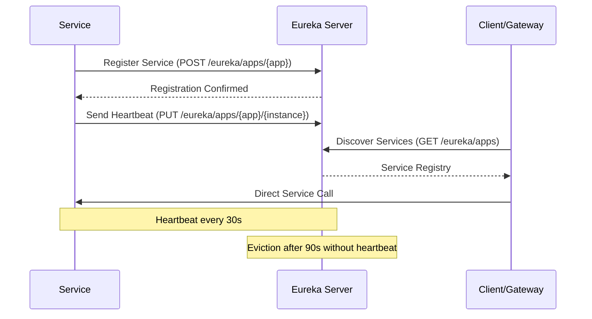

# Eureka Server - Service Discovery
## Netflix Eureka Service Registry for MTN Admission System

[](https://github.com/Netflix/eureka)
[](#service-registry)
[](#health-monitoring)

---

## 📋 Overview

The Eureka Server provides **service discovery and registration** capabilities for the MTN Admission System microservices architecture. It enables:

- **Service Registration**: Automatic service registration and deregistration
- **Service Discovery**: Dynamic service location and load balancing
- **Health Monitoring**: Continuous health checking and failover
- **Dashboard**: Web UI for service registry visualization
- **High Availability**: Clustered deployment support

---

## 🏗️ Architecture

### Service Discovery Flow


### Key Components
- **Service Registry**: Central registry of all service instances
- **Health Monitor**: Tracks service health via heartbeats
- **Load Balancer**: Client-side load balancing information
- **Self-Preservation**: Protects against network partition scenarios
- **Dashboard**: Web interface for registry visualization

---

## 🚀 Quick Start

### Prerequisites
- Java 17+
- Maven 3.8+
- Docker (for containerized deployment)

### Local Development
```bash
# Navigate to Eureka Server
cd platform/eureka-server

# Run locally
mvn spring-boot:run

# With specific profile
mvn spring-boot:run -Dspring.profiles.active=local

# Build JAR
mvn clean package

# Run built JAR
java -jar target/eureka-server-1.0.0.jar
```

### Docker Deployment
```bash
# Build Docker image
docker build -t mtn-eureka-server .

# Run with Docker Compose
docker-compose up -d eureka-server

# Access dashboard
open http://localhost:8761
```

---

## ⚙️ Configuration

### Application Configuration (`application.yml`)
```yaml
server:
  port: 8761

spring:
  application:
    name: eureka-server

# Eureka Server Configuration
eureka:
  server:
    # Enable self-preservation (production)
    enable-self-preservation: true
    
    # Eviction interval (how often to check for expired leases)
    eviction-interval-timer-in-ms: 15000
    
    # Response cache settings
    response-cache-auto-expiration-in-seconds: 30
    response-cache-update-interval-ms: 15000
    
    # Renewal threshold for self-preservation
    renewal-percent-threshold: 0.85
    
    # Expected client renewal interval
    expected-client-renewal-interval-seconds: 30
    
  client:
    # This server should not register itself as a client
    register-with-eureka: false
    fetch-registry: false
    
    # Service URLs for high availability
    service-url:
      defaultZone: ${EUREKA_SERVICE_URL:http://localhost:8761/eureka/}
      
  instance:
    hostname: ${HOSTNAME:eureka-server}
    prefer-ip-address: true

# Management and Observability    
management:
  endpoints:
    web:
      exposure:
        include: "*"
  endpoint:
    health:
      show-details: always
  tracing:
    sampling:
      probability: 1.0

# Logging Configuration      
logging:
  level:
    com.netflix.eureka: INFO
    com.netflix.discovery: INFO
```

### Environment-Specific Profiles

#### Development Profile (`application-dev.yml`)
```yaml
eureka:
  server:
    enable-self-preservation: false  # Faster eviction in dev
    eviction-interval-timer-in-ms: 5000
  instance:
    hostname: localhost

logging:
  level:
    com.netflix.eureka: DEBUG
    com.netflix.discovery: DEBUG
```

#### Production Profile (`application-prod.yml`)
```yaml
eureka:
  server:
    enable-self-preservation: true
    renewal-percent-threshold: 0.85
  client:
    service-url:
      # Multiple Eureka servers for HA
      defaultZone: http://eureka-1:8761/eureka/,http://eureka-2:8761/eureka/
      
security:
  basic:
    enabled: true
  user:
    name: ${EUREKA_USERNAME:admin}
    password: ${EUREKA_PASSWORD:admin123}
```

### Environment Variables
```bash
# Eureka Configuration
EUREKA_SERVICE_URL=http://eureka-server:8761/eureka/
EUREKA_USERNAME=admin
EUREKA_PASSWORD=admin123

# High Availability Setup
EUREKA_CLUSTER_PEER1=http://eureka-1:8761/eureka/
EUREKA_CLUSTER_PEER2=http://eureka-2:8761/eureka/

# Observability
OTEL_EXPORTER_OTLP_ENDPOINT=http://otel-collector:4317
OTEL_SERVICE_NAME=eureka-server
OTEL_RESOURCE_ATTRIBUTES=service.name=eureka-server,service.version=1.0.0
```

---

## 🔍 Service Registry

### Service Registration
Services automatically register with Eureka using the Eureka Client library:

```yaml
# Service configuration (application.yml)
eureka:
  client:
    service-url:
      defaultZone: http://eureka-server:8761/eureka/
    register-with-eureka: true
    fetch-registry: true
    
  instance:
    prefer-ip-address: true
    lease-renewal-interval-in-seconds: 30
    lease-expiration-duration-in-seconds: 90
    instance-id: ${spring.application.name}:${spring.application.instance-id:${random.value}}
```

### Service Discovery APIs
```bash
# Get all registered services
curl http://localhost:8761/eureka/apps

# Get specific service instances  
curl http://localhost:8761/eureka/apps/API-GATEWAY

# Get service instance details
curl http://localhost:8761/eureka/apps/API-GATEWAY/api-gateway:1234

# Service health check
curl http://localhost:8761/eureka/apps/API-GATEWAY/api-gateway:1234/status
```

### Service Status Codes
| Status | Description | Action |
|--------|-------------|---------|
| **UP** | Service is healthy and available | Route traffic |
| **DOWN** | Service is unhealthy | Stop routing traffic |
| **OUT_OF_SERVICE** | Service is temporarily unavailable | Stop routing traffic |
| **UNKNOWN** | Service status is unknown | Use with caution |

---

## 📊 Dashboard and Monitoring

### Eureka Dashboard
Access the web dashboard at: **http://localhost:8761**

The dashboard shows:
- **Registered Services**: All services and their instances
- **Service Status**: Health status and metadata
- **Instance Information**: IP addresses, ports, health check URLs
- **Lease Information**: Registration and renewal timestamps
- **System Status**: Self-preservation mode and registry statistics

### Dashboard Features
```
System Status:
- Environment: development
- Data center: MyOwn
- Current time: 2024-01-15 14:30:25
- Up time: 2 hours, 15 minutes
- Lease expiration enabled: true
- Renews threshold: 2
- Renews (last min): 8

General Info:
- total-avail-memory: 1024mb
- environment: development  
- num-of-cpus: 8
- current-memory-usage: 256mb (25%)

Instance Info:
- ipAddr: 172.18.0.5
- status: UP
```

### Service Registry REST API
```bash
# Register a new service instance
curl -X POST http://localhost:8761/eureka/apps/MY-SERVICE \
  -H "Content-Type: application/json" \
  -d '{
    "instance": {
      "instanceId": "my-service:8080",
      "hostName": "my-service",
      "app": "MY-SERVICE",
      "ipAddr": "192.168.1.100",
      "status": "UP",
      "overriddenStatus": "UNKNOWN",
      "port": {"$": 8080, "@enabled": true},
      "securePort": {"$": 443, "@enabled": false},
      "countryId": 1,
      "dataCenterInfo": {
        "@class": "com.netflix.appinfo.InstanceInfo$DefaultDataCenterInfo",
        "name": "MyOwn"
      },
      "leaseInfo": {
        "renewalIntervalInSecs": 30,
        "durationInSecs": 90
      },
      "metadata": {
        "management.port": "8081"
      },
      "homePageUrl": "http://my-service:8080/",
      "statusPageUrl": "http://my-service:8081/actuator/info",
      "healthCheckUrl": "http://my-service:8081/actuator/health"
    }
  }'

# Send heartbeat (renew lease)
curl -X PUT http://localhost:8761/eureka/apps/MY-SERVICE/my-service:8080

# Deregister service instance
curl -X DELETE http://localhost:8761/eureka/apps/MY-SERVICE/my-service:8080
```

---

## 🔄 Health Monitoring

### Health Check Configuration
```yaml
# Service health check setup
management:
  endpoints:
    web:
      base-path: /actuator
      exposure:
        include: health,info,metrics
        
  endpoint:
    health:
      show-details: always
      
eureka:
  instance:
    health-check-url: http://${spring.cloud.client.ip-address}:${management.server.port:${server.port}}/actuator/health
    health-check-url-path: /actuator/health
    status-page-url: http://${spring.cloud.client.ip-address}:${management.server.port:${server.port}}/actuator/info
    home-page-url: http://${spring.cloud.client.ip-address}:${server.port}/
```

### Health Check Validation
```bash
# Check Eureka Server health
curl http://localhost:8761/actuator/health

# Response example
{
  "status": "UP",
  "components": {
    "diskSpace": {
      "status": "UP",
      "details": {
        "total": 21474836480,
        "free": 8589934592,
        "threshold": 10485760,
        "exists": true
      }
    },
    "ping": {
      "status": "UP"
    }
  }
}

# Check registered service health through Eureka
curl http://localhost:8761/eureka/apps/API-GATEWAY | grep -i status
```

### Self-Preservation Mode
```yaml
# Self-preservation configuration
eureka:
  server:
    enable-self-preservation: true
    
    # Threshold for enabling self-preservation
    # If renewal rate falls below this percentage, enable self-preservation
    renewal-percent-threshold: 0.85
    
    # How often to run eviction task (in ms)
    eviction-interval-timer-in-ms: 60000
```

**Self-Preservation Mode Benefits:**
- Protects against network partitions
- Prevents mass service eviction during network issues
- Maintains service registry stability
- Logs warnings instead of evicting services

---

## ⚡ Performance and Tuning

### JVM Configuration
```bash
# JVM tuning for Eureka Server
JAVA_OPTS: >-
  -Xmx2g -Xms1g
  -XX:+UseG1GC
  -XX:MaxGCPauseMillis=200
  -XX:+UnlockExperimentalVMOptions
  -XX:+UseCGroupMemoryLimitForHeap
  -Dspring.main.lazy-initialization=true
```

### Caching Configuration
```yaml
eureka:
  server:
    # Response cache for client requests
    use-read-only-response-cache: true
    response-cache-auto-expiration-in-seconds: 180
    response-cache-update-interval-ms: 30000
    
    # Delta cache for client updates
    retention-time-in-m-s-in-delta-queue: 300000
    delta-retention-timer-interval-in-ms: 30000
```

### Network Configuration
```yaml
eureka:
  server:
    # Socket connection settings
    peer-eureka-nodes-update-interval-ms: 600000
    peer-eureka-status-refresh-time-interval-ms: 30000
    
    # Client connection settings  
    renewal-timeout-in-ms: 15000
    connection-idle-timeout-seconds: 30
```

### Monitoring Metrics
```bash
# Key Eureka metrics to monitor
curl http://localhost:8761/actuator/metrics | grep eureka

# Important metrics:
# - eureka.server.registry.size (number of registered instances)
# - eureka.server.renewal.rate (heartbeats per minute)
# - eureka.server.self.preservation.enabled (self-preservation status)
# - eureka.server.evictions (evicted instances)
# - eureka.server.lease.expirations (expired leases)
```

---

## 🚨 Troubleshooting

### Common Issues

#### Services Not Registering
```bash
# Check Eureka Server logs
docker logs eureka-server

# Verify service configuration
curl http://service:port/actuator/eureka

# Check network connectivity
curl http://eureka-server:8761/eureka/apps
```

#### Self-Preservation Mode Issues
```bash
# Check self-preservation status
curl http://localhost:8761/actuator/metrics/eureka.server.self.preservation.enabled

# Disable for debugging (dev only)
# eureka.server.enable-self-preservation=false
```

#### High Memory Usage
```bash
# Check registry size
curl http://localhost:8761/actuator/metrics/eureka.server.registry.size

# Monitor JVM memory
curl http://localhost:8761/actuator/metrics/jvm.memory.used

# Check cache statistics
curl http://localhost:8761/actuator/metrics | grep cache
```

### Log Analysis
```bash
# Filter Eureka-specific logs
docker logs eureka-server | grep "com.netflix.eureka"

# Check registration events
docker logs eureka-server | grep "Registered instance"

# Monitor heartbeat failures
docker logs eureka-server | grep "Cancelled instance"

# Self-preservation warnings
docker logs eureka-server | grep "THE SELF PRESERVATION MODE IS TURNED ON"
```

### Performance Tuning Issues
```yaml
# Optimize for high-throughput scenarios
eureka:
  server:
    # Faster eviction for development
    eviction-interval-timer-in-ms: 5000
    
    # Reduce cache update interval
    response-cache-update-interval-ms: 15000
    
    # Disable self-preservation in development
    enable-self-preservation: false
```

---

## 🔧 High Availability Setup

### Multi-Node Cluster Configuration
```yaml
# Eureka Server 1 configuration
spring:
  profiles: eureka-1
eureka:
  instance:
    hostname: eureka-1
  client:
    service-url:
      defaultZone: http://eureka-2:8761/eureka/,http://eureka-3:8761/eureka/

---      
# Eureka Server 2 configuration  
spring:
  profiles: eureka-2
eureka:
  instance:
    hostname: eureka-2
  client:
    service-url:
      defaultZone: http://eureka-1:8761/eureka/,http://eureka-3:8761/eureka/

---
# Eureka Server 3 configuration
spring:
  profiles: eureka-3
eureka:
  instance:
    hostname: eureka-3
  client:
    service-url:
      defaultZone: http://eureka-1:8761/eureka/,http://eureka-2:8761/eureka/
```

### Docker Compose HA Setup
```yaml
version: '3.8'
services:
  eureka-1:
    image: mtn-eureka-server
    environment:
      - SPRING_PROFILES_ACTIVE=eureka-1
      - EUREKA_INSTANCE_HOSTNAME=eureka-1
    ports:
      - "8761:8761"
    networks:
      - eureka-cluster
      
  eureka-2:
    image: mtn-eureka-server
    environment:
      - SPRING_PROFILES_ACTIVE=eureka-2  
      - EUREKA_INSTANCE_HOSTNAME=eureka-2
    ports:
      - "8762:8761"
    networks:
      - eureka-cluster
      
  eureka-3:
    image: mtn-eureka-server
    environment:
      - SPRING_PROFILES_ACTIVE=eureka-3
      - EUREKA_INSTANCE_HOSTNAME=eureka-3
    ports:
      - "8763:8761"
    networks:
      - eureka-cluster

networks:
  eureka-cluster:
    driver: bridge
```

### Client HA Configuration
```yaml
# Service client configuration for HA
eureka:
  client:
    service-url:
      defaultZone: http://eureka-1:8761/eureka/,http://eureka-2:8761/eureka/,http://eureka-3:8761/eureka/
    
    # Retry configuration
    initial-instance-info-replication-interval-seconds: 40
    registry-fetch-interval-seconds: 30
    
    # Backup registry configuration
    backup-registry-impl: com.netflix.discovery.BackupRegistry
```

---

## 🔐 Security Configuration

### Basic Authentication
```yaml
# Enable basic auth for Eureka dashboard
spring:
  security:
    user:
      name: ${EUREKA_USERNAME:admin}
      password: ${EUREKA_PASSWORD:admin123}
      roles: ADMIN

# Client authentication
eureka:
  client:
    service-url:
      defaultZone: http://${EUREKA_USERNAME:admin}:${EUREKA_PASSWORD:admin123}@eureka-server:8761/eureka/
```

### HTTPS Configuration
```yaml
# Enable HTTPS for Eureka Server
server:
  port: 8761
  ssl:
    enabled: true
    key-store: classpath:eureka-server.p12
    key-store-password: ${SSL_KEYSTORE_PASSWORD}
    key-store-type: PKCS12
    
eureka:
  instance:
    secure-port-enabled: true
    secure-port: 8761
    non-secure-port-enabled: false
```

---

## 📚 Additional Resources

### Documentation Links
- [Netflix Eureka Wiki](https://github.com/Netflix/eureka/wiki)
- [Spring Cloud Netflix Documentation](https://docs.spring.io/spring-cloud-netflix/docs/current/reference/html/)
- [Service Discovery Patterns](https://microservices.io/patterns/service-registry.html)

### Monitoring and Dashboards
- **Eureka Dashboard**: http://localhost:8761
- **Health Check**: http://localhost:8761/actuator/health
- **Metrics**: http://localhost:8761/actuator/metrics
- **Service Registry API**: http://localhost:8761/eureka/apps

### Configuration Files
- [`application.yml`](./src/main/resources/application.yml) - Main configuration
- [`pom.xml`](./pom.xml) - Maven dependencies  
- [`Dockerfile`](./Dockerfile) - Container configuration
- [`bootstrap.yml`](./src/main/resources/bootstrap.yml) - Bootstrap configuration

### Integration Examples
- [API Gateway Integration](../api-gateway/README.md#service-discovery-integration)
- [Service Client Configuration](../../docs/service_client_setup.md)
- [Load Balancing Setup](../../docs/load_balancing.md)

---

**🔍 Your central service registry for dynamic microservices discovery!**